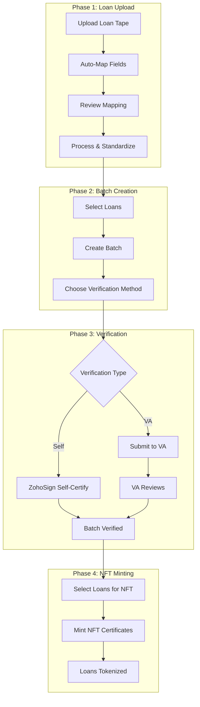

  <Icon icon="file-upload" size={80} color="#0F4C81" />

# Welcome to Loan Onboarding

Intain Markets provides a comprehensive digital platform for onboarding loans, verifying data accuracy, and creating blockchain-based NFT certificates. This guide walks you through every step of the process, from loan tape upload to NFT minting.

<Info>
  **Common Process:** Loan onboarding, verification, and NFT minting are common workflows used across all transaction types including Credit Facility, Securitization, and Whole Loan deals.
</Info>

## What is Loan Onboarding?

Loan onboarding is the process of importing loan data into the Intain Markets platform, standardizing it to a common format, and preparing it for verification and tokenization. This includes:

- **Uploading loan tapes** (Excel/CSV files)
- **Mapping fields** to standard formats
- **Processing and validating** loan data
- **Creating verification batches**
- **Verifying loan accuracy** (self-certification or VA verification)
- **Minting NFT certificates** on blockchain

## Key Features

<CardGroup cols={3}>
  <Card title="Automated Field Mapping" icon="arrows-rotate">
    AI-powered field mapping from loan tape to standard format
  </Card>
  <Card title="Flexible Verification" icon="shield-check">
    Self-certification or third-party VA verification options
  </Card>
  <Card title="Blockchain NFTs" icon="coins">
    Immutable NFT certificates for verified loans
  </Card>
  <Card title="Batch Processing" icon="layer-group">
    Efficient batch management for multiple loans
  </Card>
  <Card title="IPFS Storage" icon="database">
    Decentralized document storage for certificates
  </Card>
  <Card title="Status Tracking" icon="chart-line">
    Real-time status updates throughout the workflow
  </Card>
</CardGroup>

## Platform Participants

<CardGroup cols={2}>
  <Card title="Issuer" icon="building">
    Uploads loan tapes, creates batches, and manages verification
  </Card>
  <Card title="Verification Agent (VA)" icon="user-shield">
    Reviews and certifies loan data accuracy for third-party verification
  </Card>
</CardGroup>

## Complete Workflow at a Glance

## Quick Navigation

<CardGroup cols={2}>
  <Card title="Overview & Concepts" icon="book-open" href="/user-guide/loan-onboarding/overview">
    Understand the complete loan onboarding workflow and key concepts
  </Card>
  <Card title="Roles & Permissions" icon="users" href="/user-guide/loan-onboarding/roles-permissions">
    Learn about Issuer and VA roles and their responsibilities
  </Card>
  <Card title="Loan Onboarding" icon="file-upload" href="/user-guide/loan-onboarding/loan-onboarding">
    Upload loan tapes and map fields to standard format
  </Card>
  <Card title="Batch Management" icon="layer-group" href="/user-guide/loan-onboarding/batch-management">
    Create and manage verification batches
  </Card>
  <Card title="Verification Flow" icon="shield-check" href="/user-guide/loan-onboarding/verification-flow">
    Self-certification and VA verification processes
  </Card>
  <Card title="NFT Minting" icon="coins" href="/user-guide/loan-onboarding/nft-minting">
    Create blockchain NFT certificates for verified loans
  </Card>
  <Card title="VA Operations" icon="user-shield" href="/user-guide/loan-onboarding/va-operations">
    Verification Agent dashboard and workflows
  </Card>
</CardGroup>

---

<Card title="Contact Support" icon="headset" href="mailto:support@intainft.com" target="_blank">
  Need help? Our support team is available to assist you with any questions about loan onboarding and verification.
</Card>
