  <Icon icon="building-columns" size={80} color="#0F4C81" />

## Welcome to the Credit Facility Module

The **Credit Facility Module** in Intain Markets enables organizations to manage the complete lifecycle of credit facility transactions. This guide will walk you through every step—from creating your initial term sheet to receiving funding from lenders.

<CardGroup cols={2}>
  <Card title="Access Platform" icon="rocket" href="https://intainmarkets.us/" target="_blank">
    Launch Intain Markets platform
  </Card>
  <Card title="Workflow Overview" icon="diagram-project" href="/user-guide/credit-facility/overview">
    Understand the complete credit facility workflow
  </Card>
</CardGroup>

---

## How the Credit Facility Works

The Credit Facility workflow guides you through four main stages. Each stage builds upon the previous one, creating a streamlined path from initial request to receiving funds.

<Steps>
  <Step title="Term Sheet Creation" icon="file-contract">
    **You (the Borrower)** start by creating a term sheet that outlines your credit facility request—how much you need, the terms, and supporting documents. After signing electronically, you submit it for review.
  </Step>
  <Step title="Master Commitment Setup" icon="handshake">
    Once your term sheet is approved, a **Master Commitment** is automatically created. The Facility Agent configures the lenders and rules, then lenders review and approve it.
  </Step>
  <Step title="Funding Request" icon="money-bill-wave">
    With an active Master Commitment, you can now **request funds**. Submit your funding request with the amount you need, and the Facility Agent will review and approve it.
  </Step>
  <Step title="Funding & Token Transfer" icon="coins">
    Approved requests generate **Funding Notices** automatically. Tokens are created and distributed, and lenders transfer funds directly to you.
  </Step>
</Steps>

---

## Quick Navigation

Find the guide you need:

<CardGroup cols={2}>
  <Card title="Roles & Permissions" icon="users" href="/user-guide/credit-facility/roles-permissions">
    Learn about the different user roles and what each can do in the platform.
  </Card>
  <Card title="Term Sheet Guide" icon="file-signature" href="/user-guide/credit-facility/term-sheet">
    Step-by-step instructions to create, sign, and submit your term sheet.
  </Card>
  <Card title="Master Commitment Guide" icon="building-columns" href="/user-guide/credit-facility/master-commitment">
    Understand how master commitments are configured and approved.
  </Card>
  <Card title="Funding Request Guide" icon="file-invoice-dollar" href="/user-guide/credit-facility/funding-request">
    Learn how to submit funding requests and track their status.
  </Card>
  <Card title="Funding Notice Guide" icon="coin" href="/user-guide/credit-facility/funding-notice">
    Understand the funding notice process and token distribution.
  </Card>
  <Card title="Loan Mapping Guide" icon="link" href="/user-guide/credit-facility/loan-mapping">
    Map your loans to the credit facility for collateral management.
  </Card>
</CardGroup>

---

## Who Uses This Module?

<AccordionGroup>
  <Accordion title="Issuer (Borrower)" icon="building" defaultOpen>
    **You are seeking funding.** As the Borrower, you:
    - Create and sign term sheets to request credit facilities
    - Submit funding requests when you need capital
    - Approve token transfers to receive funds
    - Map your loans as collateral
  </Accordion>
  
  <Accordion title="Facility Agent" icon="user-tie">
    **They manage the process.** The Facility Agent:
    - Reviews and approves/rejects your term sheets
    - Configures master commitments with lender details
    - Approves or rejects your funding requests
    - Signs funding notices on behalf of lenders
  </Accordion>
  
  <Accordion title="Lender" icon="landmark">
    **They provide the funds.** Lenders:
    - Review and approve master commitments
    - View funding notices after your approval
    - Transfer funds directly to you
    - Track their investment and token allocations
  </Accordion>
  
  <Accordion title="Servicer" icon="gears">
    **They manage ongoing operations.** Servicers:
    - Upload monthly loan performance data
    - Track loan payments and performance
    - Support borrowing base calculations
  </Accordion>
</AccordionGroup>

---

## Complete Workflow at a Glance

```mermaid
flowchart TD
    subgraph TermSheet["📄 Term Sheet"]
        TS1[DRAFT] -->|Sign Electronically| TS2[BorrowerSigned]
        TS2 -->|Submit| TS3[Under Review]
        TS3 -->|Approved| TS4[Accepted]
        TS3 -->|Declined| TS5[Rejected]
        TS3 -->|Needs Changes| TS6[Revision Needed]
        TS6 -->|Edit & Resubmit| TS2
    end
    
    subgraph MasterCommitment["🤝 Master Commitment"]
        TS4 -->|Auto-Created| MC1[Setup in Progress]
        MC1 -->|FA Submits| MC2[Awaiting Lender Approval]
        MC2 -->|Lender Approves| MC3[ACTIVE]
    end
    
    subgraph FundingRequest["💰 Funding Request"]
        MC3 -->|Create Request| FR1[Draft Request]
        FR1 -->|Submit| FR2[Under Review]
        FR2 -->|Approved| FR3[Request Approved]
        FR2 -->|Declined| FR4[Request Rejected]
        FR2 -->|Needs Changes| FR5[Revision Needed]
        FR5 -->|Edit & Resubmit| FR1
    end
    
    subgraph FundingNotice["🪙 Funding Notice"]
        FR3 -->|Auto-Generated| FN1[Preparing Tokens]
        FN1 -->|Tokens Created| FN2[Ready for Approval]
        FN2 -->|Borrower Approves| FN3[Visible to Lenders]
        FN3 -->|Lenders Confirm| FN4[Funds Transferred ✅]
    end
```

---

## Key Platform Features

<CardGroup cols={3}>
  <Card title="Electronic Signatures" icon="signature">
    Sign documents securely through Zoho Sign at every step of the process.
  </Card>
  <Card title="Blockchain Security" icon="shield-halved">
    All transactions are recorded on blockchain for transparency and security.
  </Card>
  <Card title="Document Storage" icon="cloud">
    Documents are stored securely in IPFS with complete version history.
  </Card>
  <Card title="Real-time Tracking" icon="bolt">
    Track status updates and receive notifications as your requests progress.
  </Card>
  <Card title="Borrowing Base" icon="calculator">
    Automated calculations to determine your available borrowing capacity.
  </Card>
  <Card title="Token Distribution" icon="coins">
    Seamless token creation and distribution for funding execution.
  </Card>
</CardGroup>

---

## Need Help?

<CardGroup cols={2}>
  <Card title="Contact Support" icon="headset" href="mailto:support@intainft.com">
    Reach our support team for assistance
  </Card>
  <Card title="Platform Access" icon="globe" href="https://intainmarkets.us/" target="_blank">
    Access the Intain Markets platform
  </Card>
</CardGroup>
