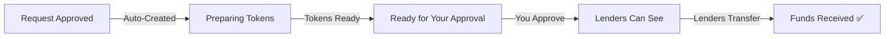
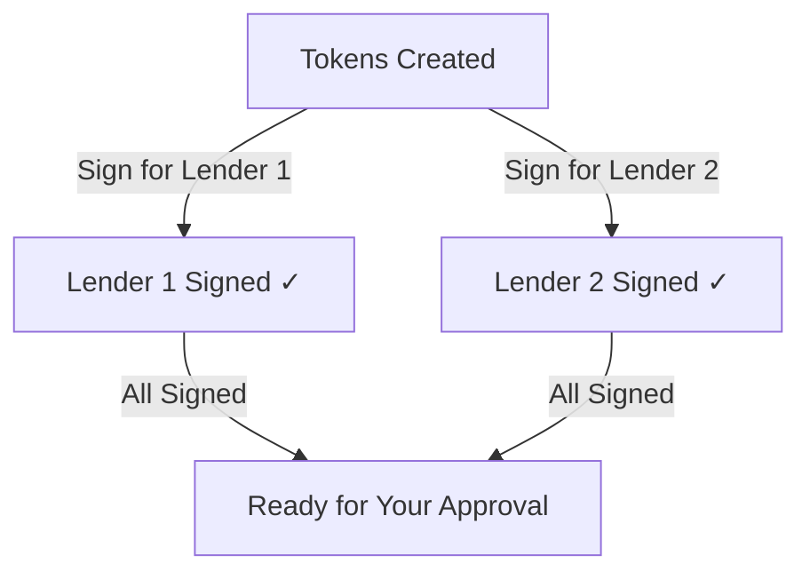
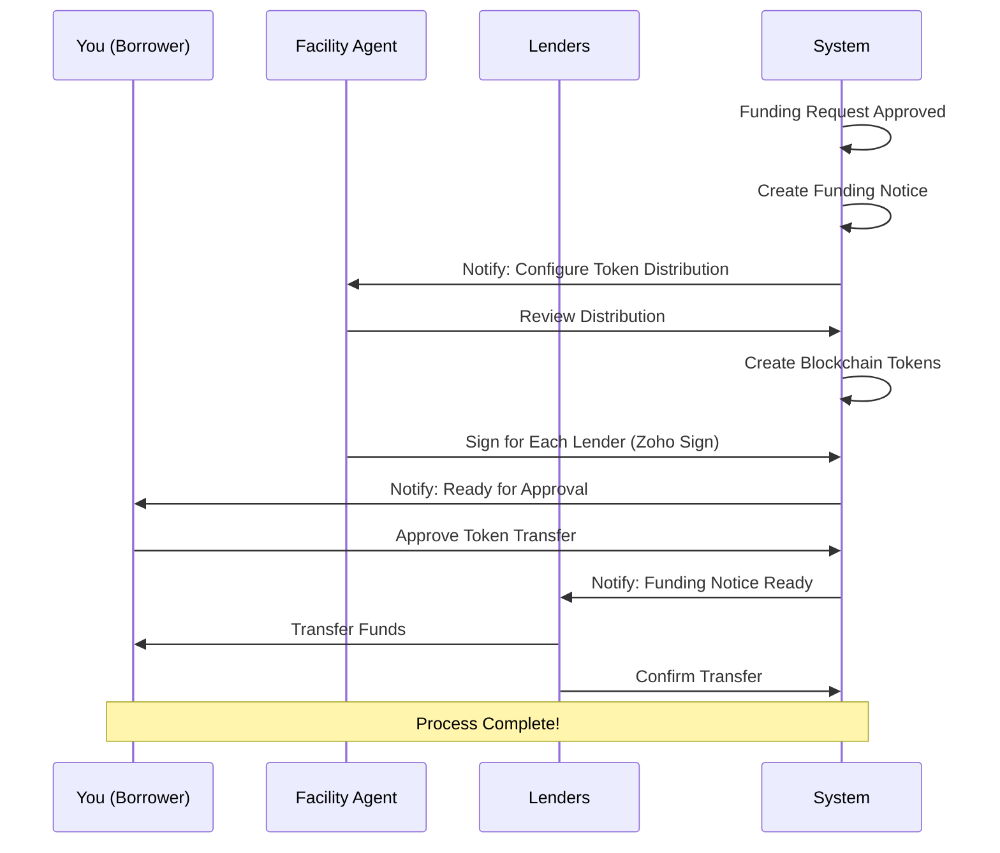

## What is a Funding Notice?

A **Funding Notice** is the document that manages the actual fund transfer. It's automatically created when your funding request is approved. The funding notice handles token creation, electronic signatures, and tracks when lenders transfer funds to you.

<Warning>
**Important:** You cannot create a Funding Notice manually. It's automatically generated when your Funding Request is approved.
</Warning>

---

## Funding Notice Journey

---

## How the Funding Process Works

### Stage 1: Funding Notice Created

When your funding request is approved, the system automatically:

<Steps>
  <Step title="Creates Funding Notice">
    A new Funding Notice is generated linked to your approved request.
  </Step>
  <Step title="Calculates Token Distribution">
    The system calculates how much each lender will fund based on their share.
  </Step>
  <Step title="Prepares for Token Creation">
    Status is set to **"Preparing Tokens"** while the system sets up.
  </Step>
</Steps>

---

### Stage 2: Token Distribution Setup

The Facility Agent reviews and finalizes the token distribution:

<AccordionGroup>
  <Accordion title="What is Token Distribution?" icon="chart-pie" defaultOpen>
    Token distribution determines how much each lender will fund. It's calculated based on each lender's voting percentage:
    
    **Example:**
    - You requested: $10,000,000
    - Lender A (60% share): $6,000,000
    - Lender B (40% share): $4,000,000
    
    Each lender funds their proportional share.
  </Accordion>
  
  <Accordion title="What Happens During This Stage" icon="gears">
    The Facility Agent:
    1. Reviews the token distribution
    2. Confirms the amounts for each lender
    3. Triggers token creation on the blockchain
    4. Status changes to **"Tokens Ready"**
  </Accordion>
</AccordionGroup>

<Info>
**Blockchain Tokens:** The platform creates blockchain tokens representing the funding. This provides a secure, transparent record of the transaction.
</Info>

---

### Stage 3: Electronic Signatures

The Facility Agent signs for each lender via Zoho Sign:

<Note>
**Individual Tracking:** Each lender's signature is tracked separately. You can see which lenders have been signed and which are pending.
</Note>

---

### Stage 4: Your Approval (Borrower)

Now it's your turn! You need to approve the token transfer:

<Steps>
  <Step title="Review Token Distribution">
    Log in and review how much each lender will fund.
  </Step>
  <Step title="Verify Details">
    Confirm the total amount and distribution is correct.
  </Step>
  <Step title="Approve Transfer">
    Click **"Approve Token Transfer"** to authorize the transaction.
  </Step>
  <Step title="Status Updates">
    Status changes to **"Approved"** and lenders can now see the funding notice.
  </Step>
</Steps>

<Warning>
**Before You Approve:** Make sure you've reviewed everything carefully. Once approved, lenders will be able to see the funding notice and begin transferring funds.
</Warning>

---

### Stage 5: Lenders Transfer Funds

After your approval, lenders complete the final step:

<AccordionGroup>
  <Accordion title="What Lenders See" icon="eye" defaultOpen>
    After you approve, lenders can:
    - View the funding notice in their dashboard
    - See their allocated amount
    - Access your payment details
    - Initiate their fund transfer
  </Accordion>
  
  <Accordion title="How Lenders Transfer Funds" icon="money-bill-transfer">
    Each lender:
    1. Reviews the funding notice
    2. Transfers funds through their banking system
    3. Confirms the transfer in the platform
    4. Their status updates to **"Funds Transferred"**
  </Accordion>
  
  <Accordion title="Tracking Progress" icon="chart-simple">
    You can track each lender's status:
    - **Pending** - Lender hasn't transferred yet
    - **Transferred** - Lender has confirmed payment
    
    All parties can see the progress in real-time.
  </Accordion>
</AccordionGroup>

---

## Understanding Your Status

| Status | What It Means | What's Happening? |
|--------|--------------|-------------------|
| **Preparing Tokens** | Setting up | Token distribution being configured |
| **Tokens Ready** | Waiting for you | Review and approve the transfer |
| **Approved** | Visible to lenders | Lenders can now see and transfer |
| **Funds Transferred** | Complete! | Lenders have confirmed payment |

---

## What You See in a Funding Notice

| Information | Description |
|------------|-------------|
| **Funding Notice ID** | Unique identifier |
| **Request Amount** | Total amount being funded |
| **Funding Date** | When funds are expected |
| **Lender Distribution** | How much each lender is funding |
| **Token Status** | Whether tokens have been created |
| **Signature Status** | Which lenders have been signed |
| **Transfer Status** | Which lenders have transferred funds |

---

## Complete Process Flow

---

## Borrowing Base Updates

Throughout this process, your borrowing base is recalculated:

| When | What Happens |
|------|-------------|
| **Token Distribution** | Available capacity updated |
| **All Funds Transferred** | Final calculation performed |

<Info>
**Automatic Updates:** You don't need to manually update anything. The system automatically recalculates your borrowing base and available capacity.
</Info>

---

## Tracking Individual Lenders

Each lender in your funding notice has separate tracking:

| Status | Meaning |
|--------|---------|
| **Signature: Pending** | FA hasn't signed for this lender yet |
| **Signature: Complete** | FA has signed for this lender |
| **Transfer: Pending** | Lender hasn't confirmed payment |
| **Transfer: Complete** | Lender has confirmed fund transfer |

---

## Common Questions

<AccordionGroup>
  <Accordion title="Why can't I see the funding notice yet?" icon="eye-slash">
    The funding notice goes through several stages before you need to act. If you don't see it:
    - Your funding request may still be pending approval
    - The Facility Agent may still be configuring distribution
    - Tokens may still be being created
    
    You'll receive a notification when it's ready for your approval.
  </Accordion>
  
  <Accordion title="Why can't the lender see the funding notice?" icon="user-slash">
    Lenders can only see funding notices **after** you approve the token transfer. If a lender can't see it:
    - Check if you've approved the transfer
    - Verify the lender is in the distribution
    - Confirm the Facility Agent has signed for that lender
  </Accordion>
  
  <Accordion title="What are the blockchain tokens for?" icon="coins">
    The blockchain tokens provide:
    - **Transparency** - Clear record of who funded what
    - **Security** - Immutable transaction record
    - **Tracking** - Easy verification of fund movements
    
    You don't need to manage the tokens directly—the platform handles everything.
  </Accordion>
  
  <Accordion title="How long until I receive funds?" icon="clock">
    Timeline depends on:
    - How quickly you approve the transfer
    - How quickly each lender processes their payment
    
    You can track progress in real-time on your dashboard.
  </Accordion>
  
  <Accordion title="What if a lender doesn't transfer?" icon="triangle-exclamation">
    If a lender hasn't transferred:
    - Their status will show as "Pending"
    - The Facility Agent can follow up with them
    - Other lenders' transfers proceed independently
    
    Contact your Facility Agent if you have concerns about a delayed transfer.
  </Accordion>
</AccordionGroup>

---

## What Happens After All Funds Transfer?

When all lenders confirm their transfers:

1. **Final Calculations** - Borrowing base is finalized
2. **Records Updated** - All balances are updated
3. **Notifications Sent** - Confirmation to all parties
4. **Ready for More** - You can create new funding requests

---

## Next Steps

After receiving your funds:

<CardGroup cols={2}>
  <Card title="Map More Loans" icon="link" href="/user-guide/credit-facility/loan-mapping">
    Add more collateral to increase your borrowing capacity.
  </Card>
  <Card title="Create Another Request" icon="money-bill-wave" href="/user-guide/credit-facility/funding-request">
    Submit a new funding request when you need more capital.
  </Card>
</CardGroup>
