## What is a Funding Request?

A **Funding Request** is how you request money from your credit facility. Once you have an ACTIVE Master Commitment, you can submit funding requests whenever you need capital. Each request specifies how much you need and when you need it.

<Info>
**Prerequisite:** You can only create funding requests against Master Commitments that are **ACTIVE**. Make sure a lender has approved your Master Commitment first.
</Info>

---

## Funding Request Journey

```mermaid
flowchart LR
    A[Create Request] -->|Submit| B[Under Review]
    B -->|Approved| C[Approved ✅]
    B -->|Declined| D[Rejected ❌]
    B -->|Needs Work| E[Changes Requested]
    E -->|Edit & Resubmit| B
    C -->|Auto-Generate| F[Funding Notice Created]
```

---

## Creating a Funding Request

### Step 1: Start Your Request

<Steps>
  <Step title="Go to Your Master Commitment">
    From your dashboard, select your ACTIVE Master Commitment.
  </Step>
  <Step title="Click Create Funding Request">
    Find and click the **"Create Funding Request"** button.
  </Step>
  <Step title="Draft Created">
    A new funding request draft is created and ready for you to fill in.
  </Step>
</Steps>

<Note>
**One at a Time:** You can only have one draft funding request per Master Commitment. Complete or cancel your current request before starting a new one.
</Note>

### Step 2: Fill in Your Request Details

Complete your funding request with the following information:

| Field | What to Enter |
|-------|--------------|
| **Draw Amount** | How much money you're requesting |
| **Currency** | Usually USD (pre-selected) |
| **Funding Date** | When you need the funds |
| **Purpose of Funds** | Brief description of how you'll use the money |
| **Notes** | Any additional information for the Facility Agent |

<Tip>
**Auto-Save:** Your changes are saved automatically while in Draft status. You can leave and come back without losing your work.
</Tip>

### Step 3: Upload Supporting Documents

You may need to upload documentation to support your request:

<Steps>
  <Step title="Navigate to Documents">
    Find the document upload section in your funding request.
  </Step>
  <Step title="Upload Collateral Addendum">
    This is the primary document showing your collateral supporting this request.
  </Step>
  <Step title="Add Other Documents">
    Upload any additional supporting documentation as needed.
  </Step>
</Steps>

| Document Type | Purpose |
|--------------|---------|
| **Collateral Addendum** | Primary collateral documentation for this draw |
| **Financial Statements** | Updated financial information |
| **KYC Documents** | Compliance documentation if required |

### Step 4: Review Your Borrowing Base

The system automatically calculates your **Borrowing Base**—this tells you how much you're eligible to borrow:

| Calculation | What It Means |
|------------|---------------|
| **Borrowing Base** | Total amount you're eligible to borrow |
| **Available Capacity** | How much you can currently request |
| **Utilization** | Percentage of your facility currently in use |
| **Collateral Value** | Total value of your collateral |

<Warning>
**Stay Within Limits:** Your draw amount must be within your available capacity. If you request more than available, the Facility Agent may reject or request changes.
</Warning>

### Step 5: Submit for Review

When you're ready:

<Steps>
  <Step title="Review Everything">
    Double-check all your information, amounts, and documents.
  </Step>
  <Step title="Submit">
    Click **"Submit for Review"** to send to the Facility Agent.
  </Step>
  <Step title="Confirmation">
    Your status changes to **"Under Review"** and the Facility Agent is notified.
  </Step>
</Steps>

---

## What Happens After Submission?

### The Facility Agent's Decision

<Tabs>
  <Tab title="Approved ✅">
    **Your Request is Funded**
    
    When approved:
    - Status changes to **"Approved"**
    - A **Funding Notice** is automatically generated
    - You'll receive a notification
    - The funding process begins
    
    <Card title="Next Step" icon="arrow-right" href="/user-guide/credit-facility/funding-notice">
      Learn about Funding Notices and receiving funds
    </Card>
  </Tab>
  
  <Tab title="Rejected ❌">
    **Request Declined**
    
    If rejected:
    - Status changes to **"Rejected"**
    - The rejection reason is documented
    - This is a final state
    
    **What to Do:** Review the rejection reason. If appropriate, create a new funding request addressing the concerns.
  </Tab>
  
  <Tab title="Changes Requested 🔄">
    **Revisions Needed**
    
    If changes are requested:
    - Status changes to **"Changes Requested"**
    - You'll see comments explaining what to change
    - You can edit your request again
    - Auto-save is re-enabled
    
    **What to Do:** Make the requested changes and resubmit.
  </Tab>
</Tabs>

---

## Handling Change Requests

If the Facility Agent requests changes:

<Steps>
  <Step title="Check the Comments">
    Review what the Facility Agent needs you to change.
  </Step>
  <Step title="Make Changes">
    Update your funding request accordingly. Changes save automatically.
  </Step>
  <Step title="Resubmit">
    Submit again for another review.
  </Step>
</Steps>

---

## Understanding Your Status

| Status | What It Means | Can You Edit? |
|--------|--------------|---------------|
| **Draft** | You're working on it | ✅ Yes |
| **Under Review** | FA is reviewing | ❌ No |
| **Approved** | Request approved! | ❌ No |
| **Rejected** | Request declined | ❌ No |
| **Changes Requested** | Revisions needed | ✅ Yes |

---

## Pre-populated Information

Some information is automatically filled in from your Master Commitment:

| Information | Source |
|------------|--------|
| **Facility Name** | From your Master Commitment |
| **Total Commitment** | Maximum facility amount |
| **Advance Rate** | From your facility terms |
| **Current Balance** | Outstanding amount already borrowed |
| **Available Capacity** | How much you can still borrow |

---

## Email Notifications

The Facility Agent receives an email when you submit:

<Info>
**What They See:**
- Your funding request details
- Link to review in the platform
- Your contact information

This helps ensure quick review and response.
</Info>

---

## Common Questions

<AccordionGroup>
  <Accordion title="Why can't I create a funding request?" icon="question">
    Make sure your Master Commitment is **ACTIVE**. If it's still Draft or Awaiting Lender Approval, you need to wait for a lender to approve it first.
  </Accordion>
  
  <Accordion title="I have a draft but want to start over" icon="trash">
    You can only have one draft at a time. Either complete your current draft and submit it, or contact your administrator to help cancel it.
  </Accordion>
  
  <Accordion title="Why was my request rejected?" icon="circle-xmark">
    Common reasons include:
    - Request amount exceeds available capacity
    - Insufficient collateral documentation
    - Missing required information
    - Collateral doesn't meet eligibility rules
    
    Review the rejection reason and address those issues in a new request.
  </Accordion>
  
  <Accordion title="How is borrowing base calculated?" icon="calculator">
    The system calculates your borrowing base automatically using:
    - Your mapped loan values
    - Advance rate from your facility
    - Any outstanding draws
    - Collateral eligibility rules
    
    You don't need to calculate this yourself—the platform does it for you.
  </Accordion>
  
  <Accordion title="Can I cancel a submitted request?" icon="ban">
    Once submitted, you cannot cancel. You must wait for the Facility Agent to either approve, reject, or request changes.
  </Accordion>
</AccordionGroup>

---

## What Happens When Approved?

When your funding request is approved:

1. **Status Updates** - Your request shows as "Approved"
2. **Funding Notice Created** - The system automatically generates a Funding Notice
3. **Token Process Begins** - FT tokens are prepared for distribution
4. **Notifications Sent** - All parties are notified of the approval

---

## Next Steps

After your funding request is approved:

<Card title="Funding Notice & Token Distribution" icon="coins" href="/user-guide/credit-facility/funding-notice">
  Learn about how the Funding Notice is generated and how you receive your funds through token distribution.
</Card>
