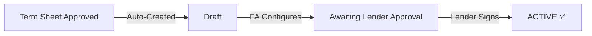
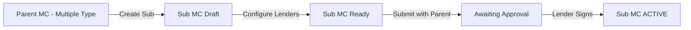

## What is a Master Commitment?

The **Master Commitment** is the formal credit facility agreement that's automatically created when your term sheet is approved. It contains all the details about your facility, including which lenders will participate and the rules for your collateral.

<Warning>
**Important:** You cannot create a Master Commitment manually. It's automatically generated when your Term Sheet is accepted by the Facility Agent.
</Warning>

---

## Master Commitment Journey

---

## What Happens When Your Term Sheet is Approved?

When the Facility Agent accepts your term sheet, the system automatically:

<Steps>
  <Step title="Creates Master Commitment">
    A new Master Commitment is generated with your term sheet details.
  </Step>
  <Step title="Copies Your Information">
    All the key terms from your term sheet are transferred over (amounts, rates, dates, etc.).
  </Step>
  <Step title="Notifies Facility Agent">
    The Facility Agent is alerted to configure the lender groups and rules.
  </Step>
</Steps>

### What Carries Over from Your Term Sheet

These details from your term sheet are automatically included and cannot be changed:

| Information | Description |
|------------|-------------|
| **Facility Amount** | The total credit amount you requested |
| **Advance Rate** | Your loan-to-value ratio |
| **Margin** | Interest rate spread |
| **Pricing Index** | Benchmark rate (SOFR, Prime, Fixed) |
| **Maturity Date** | When the facility ends |
| **Draw Frequency** | How often you can request funds |

---

## The Facility Agent's Role

While you wait, the Facility Agent configures your Master Commitment:

### What the Facility Agent Sets Up

<AccordionGroup>
  <Accordion title="Lender Groups" icon="users" defaultOpen>
    The Facility Agent selects which lenders will participate in your facility:
    
    - **Which lenders** will provide funding
    - **How much** each lender commits
    - **Voting percentage** for each lender
    
    <Note>
    The total of all lender commitments equals your facility amount. All voting percentages add up to 100%.
    </Note>
  </Accordion>
  
  <Accordion title="Collateral Rules" icon="check-double">
    Rules that define what loans can be used as collateral:
    
    - Eligible loan types (residential, commercial, etc.)
    - Minimum credit score requirements
    - Maximum loan-to-value ratios
    - Geographic restrictions
    - Property type limits
  </Accordion>
  
  <Accordion title="Servicer Assignment" icon="gears">
    The Facility Agent assigns a servicer who will:
    
    - Upload monthly loan performance data
    - Track payments and delinquencies
    - Support borrowing base calculations
  </Accordion>
</AccordionGroup>

---

## Lender Approval Process

Once configured, the Master Commitment is sent to lenders for approval:

### How Lenders See Your Facility

Lenders view your Master Commitment in their **"Opportunities"** section:

### The Lender Review Process

<Steps>
  <Step title="Lender Receives Notification">
    Selected lenders are notified that a new opportunity is available.
  </Step>
  <Step title="Lender Reviews Details">
    They review the facility terms, commitment amounts, and collateral rules.
  </Step>
  <Step title="Electronic Signature">
    To approve, the lender signs electronically via Zoho Sign.
  </Step>
  <Step title="Facility Activates">
    Once **any** lender signs, your Master Commitment becomes **ACTIVE**.
  </Step>
</Steps>

<Info>
**Quick Activation:** Your facility becomes ACTIVE as soon as **one** lender approves. You don't need to wait for all lenders—any single approval activates the commitment.
</Info>

---

## When Your Master Commitment is ACTIVE

Once active, you can start using your credit facility!

### What You Can Do Now

<CardGroup cols={2}>
  <Card title="Create Funding Requests" icon="money-bill-wave">
    Request funds against your available capacity anytime you need capital.
  </Card>
  <Card title="Map Loans" icon="link">
    Associate your loans with the facility to use them as collateral.
  </Card>
  <Card title="Track Capacity" icon="chart-line">
    Monitor your borrowing base and available funding capacity.
  </Card>
  <Card title="View Lender Status" icon="users">
    See which lenders have approved and their commitment amounts.
  </Card>
</CardGroup>

---

## Understanding Your Status

| Status | What It Means | What's Happening? |
|--------|--------------|-------------------|
| **Draft** | Being configured | Facility Agent is setting up lenders and rules |
| **Awaiting Lender Approval** | Ready for lenders | Lenders are reviewing and signing |
| **ACTIVE** | Ready to use! | You can create funding requests |

---

## Contract Types Explained

Your Master Commitment can be set up in two ways:

<Tabs>
  <Tab title="Single Contract">
    **Standard Setup** (Most Common)
    
    All lenders share one master commitment agreement.
    
    **How it works:**
    - One agreement covers all participating lenders
    - Each lender's share is tracked within the same contract
    - Token distribution calculated by voting percentage
    - Simpler to manage
    
    **Best for:** Standard credit facilities with straightforward lender arrangements.
  </Tab>
  
  <Tab title="Multiple Contracts">
    **Advanced Setup**
    
    Each lender has their own separate sub-commitment.
    
    **How it works:**
    - Main "parent" master commitment
    - Individual sub-commitments for each lender
    - Each sub-commitment can have unique terms
    - More complex structure
    
    **Best for:** Large syndicated facilities with complex lender arrangements or different terms per lender.
  </Tab>
</Tabs>

---

## Sub Master Commitments (Multiple Contract Type)

If your facility uses multiple contracts, the Facility Agent creates sub-commitments:

<Note>
Sub master commitments inherit configuration from the parent but can have their own specific lender arrangements.
</Note>

---

## Viewing Your Master Commitment

As a Borrower, you can view your Master Commitment details:

| Information | What You'll See |
|------------|-----------------|
| **Status** | Current status (Draft, Awaiting Approval, ACTIVE) |
| **Facility Amount** | Total commitment amount |
| **Terms** | Interest rate, maturity, draw frequency |
| **Lender Summary** | Which lenders are participating |
| **Collateral Rules** | What loans are eligible as collateral |
| **Available Capacity** | How much you can currently borrow |

---

## Common Questions

<AccordionGroup>
  <Accordion title="Why can't I create a Master Commitment myself?" icon="question">
    Master Commitments are complex agreements that require proper configuration by the Facility Agent. They're automatically created when your term sheet is approved to ensure all the proper details carry over correctly.
  </Accordion>
  
  <Accordion title="How long does lender approval take?" icon="clock">
    It varies by lender. The facility activates as soon as any one lender approves, so you don't need to wait for all lenders. The Facility Agent can follow up with lenders if needed.
  </Accordion>
  
  <Accordion title="What if a lender doesn't approve?" icon="user-xmark">
    The facility can still activate with other lenders. If a lender doesn't participate, their commitment amount won't be available, but you can still use the facility with the remaining lenders.
  </Accordion>
  
  <Accordion title="Can terms be changed after approval?" icon="pen">
    Once a Master Commitment is ACTIVE, its core terms cannot be changed. For significant changes, a new term sheet and master commitment would need to be created.
  </Accordion>
</AccordionGroup>

---

## What Happens After Activation?

Once your Master Commitment is **ACTIVE**, several things happen:

1. **Data sent to Analytics** - Your facility details are sent to Intain Analytics for borrowing base calculations
2. **Blockchain record created** - An immutable record is created on the blockchain
3. **You're notified** - You receive a notification that your facility is ready
4. **Funding enabled** - You can now create funding requests

---

## Next Steps

With an ACTIVE Master Commitment, you're ready to request funds:

<Card title="Create a Funding Request" icon="money-bill-wave" href="/user-guide/credit-facility/funding-request">
  Learn how to submit funding requests against your active Master Commitment.
</Card>
