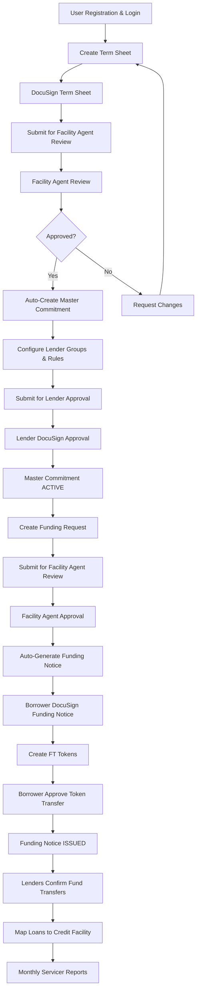

## Credit Facility Workflow Overview

The Intain Markets Credit Facility Platform streamlines the entire credit facility lifecycle through a structured, automated workflow that ensures transparency, security, and efficiency. This guide provides a comprehensive overview of the complete process.

## Workflow Stages

The credit facility process consists of four main stages, each building upon the previous one:

### **Stage 1: Term Sheet Creation & Approval**
- Borrower creates term sheet with facility terms
- DocuSign integration for electronic signatures
- Facility agent review and approval
- **Auto-trigger**: Master commitment creation upon approval

### **Stage 2: Master Commitment Configuration**
- Auto-created from approved term sheet
- Facility agent configures lender groups and rules
- Lender approval through DocuSign
- **Auto-trigger**: Status becomes ACTIVE upon lender approval

### **Stage 3: Funding Request Processing**
- Borrower creates funding requests against ACTIVE commitments
- Facility agent review and approval
- **Auto-trigger**: Funding notice generation upon approval

### **Stage 4: Funding Notice & Token Management**
- Auto-generated funding notice with DocuSign
- FT token creation and distribution
- Borrower token transfer approval
- Lender fund transfer confirmations

## Complete Workflow Diagram



## Key Components

### **1. Term Sheet Management**

**Purpose**: Define initial terms and conditions for the credit facility

**Key Features**:
- Digital term sheet creation
- DocuSign electronic signatures
- Facility agent review workflow
- Version control and revisions
- Auto-save functionality

**Status Flow**:
```
Draft → BorrowerSigned → FAReview → Accepted/Rejected/CHANGES_REQUESTED
```

### **2. Master Commitment Configuration**

**Purpose**: Formalize the credit facility agreement with detailed terms

**Key Features**:
- Auto-creation from approved term sheets
- Lender group management
- Collateral eligibility rules
- Commitment amount allocation
- DocuSign lender approval

**Status Flow**:
```
Draft → PendingLenderApproval → ACTIVE
```

### **3. Funding Request Processing**

**Purpose**: Request specific funding amounts against active commitments

**Key Features**:
- Funding request creation
- Collateral documentation
- Facility agent approval
- Auto-generation of funding notices
- Real-time status tracking

**Status Flow**:
```
DRAFT → FAReview → APPROVED/REJECTED/CHANGES_REQUESTED
```

### **4. Funding Notice & Token Management**

**Purpose**: Execute funding and manage token distribution

**Key Features**:
- Auto-generated funding notices
- FT token creation and distribution
- Borrower token transfer approval
- Individual lender tracking
- Fund transfer confirmations

**Status Flow**:
```
PENDING_ESIGN → ESIGN_COMPLETED → ISSUED
```

## Automation Features

### **Auto-Creation Workflows**
- **Master Commitment**: Automatically created when term sheet is approved
- **Funding Notice**: Automatically generated when funding request is approved
- **FT Tokens**: Automatically created after funding notice DocuSign completion

### **Status Transitions**
- **Automatic Status Updates**: System automatically updates statuses based on actions
- **Real-Time Notifications**: Users receive notifications for status changes
- **Audit Trails**: Complete history of all status changes and actions

### **Document Management**
- **IPFS Storage**: All documents stored in decentralized IPFS
- **DocuSign Integration**: Electronic signatures for all documents
- **Version Control**: Complete document versioning and history
- **Secure Access**: Role-based document access control

## User Roles & Responsibilities

### **Issuer (Borrower)**
- Create and manage term sheets
- Submit funding requests
- Approve token transfers
- Manage loan collateral
- Review facility performance

### **Facility Agent (Underwriter)**
- Review and approve term sheets
- Configure master commitments
- Approve funding requests
- Manage lender relationships
- Monitor facility performance

### **Lender (Investor)**
- Review master commitments
- Approve funding requests
- Confirm fund transfers
- Monitor investment performance
- Track token distributions

### **Servicer**
- Upload monthly loan tapes
- Generate performance reports
- Manage loan servicing
- Track loan performance
- Provide borrower support

## Key Benefits

### **Efficiency**
- **Automated Workflows**: Reduce manual processing time
- **Digital Signatures**: Eliminate paper-based processes
- **Real-Time Updates**: Instant status notifications
- **Streamlined Approval**: Faster decision-making process

### **Transparency**
- **Blockchain Records**: Immutable transaction history
- **Audit Trails**: Complete action tracking
- **Real-Time Visibility**: Live status updates
- **Document Integrity**: Secure document storage

### **Security**
- **Role-Based Access**: Granular permission control
- **Encrypted Storage**: Secure data protection
- **Digital Signatures**: Legally binding e-signatures
- **Audit Compliance**: Complete regulatory compliance

### **Scalability**
- **Cloud-Based**: Scalable infrastructure
- **API Integration**: Easy third-party integration
- **Multi-Tenant**: Support for multiple organizations
- **Global Access**: Worldwide platform access

## Getting Started

### **For New Users**
1. **Register Account**: Complete user registration
2. **Verify Identity**: Complete KYC/AML verification
3. **Access Platform**: Login to your dashboard
4. **Start Process**: Create your first term sheet or review opportunities

### **For Existing Users**
1. **Login**: Access your account
2. **Review Dashboard**: Check current status and opportunities
3. **Continue Process**: Resume where you left off
4. **Monitor Progress**: Track all active processes

## Next Steps

<Card title="Term Sheet Management" icon="file-contract" href="/user-guide/credit-facility/term-sheet">
  Learn how to create and manage term sheets
</Card>

<Card title="Master Commitment Setup" icon="handshake" href="/user-guide/credit-facility/master-commitment">
  Understand master commitment configuration
</Card>

<Card title="Funding Request Process" icon="money-bill-wave" href="/user-guide/credit-facility/funding-request">
  Learn about funding request submission and approval
</Card>

<Card title="Funding Notice & Tokens" icon="coins" href="/user-guide/credit-facility/funding-notice">
  Understand funding notice and token management
</Card>
