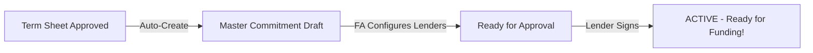
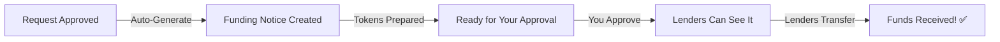
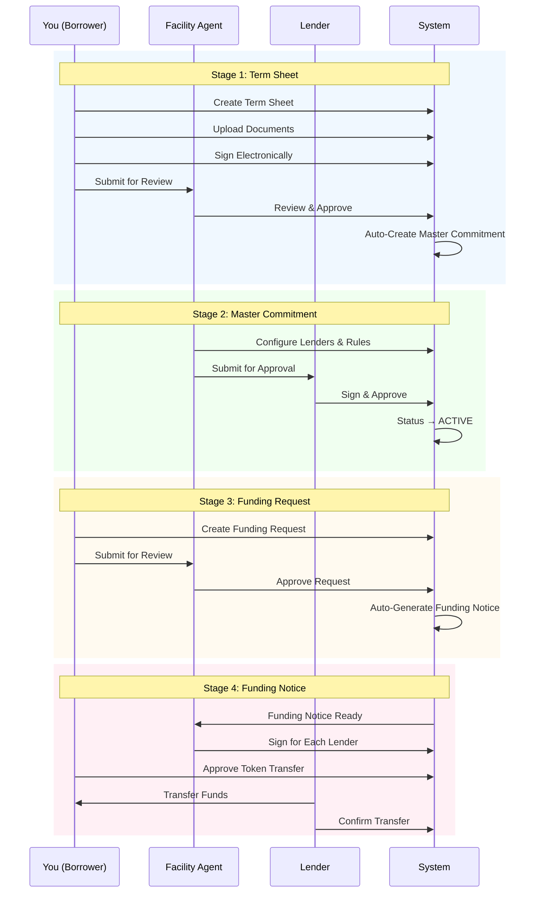

## Understanding the Credit Facility Process

The Credit Facility Module guides you through a structured process to obtain funding. Each stage has clear steps and status indicators so you always know where you are in the process.

<Card title="Access Platform" icon="rocket" href="https://intainmarkets.us/" target="_blank">
  Launch Intain Markets to start your credit facility journey
</Card>

---

## The Four Stages Explained

### Stage 1: Term Sheet (Your Proposal)

The **Term Sheet** is your initial proposal document. Think of it as your application for a credit facility.

<AccordionGroup>
  <Accordion title="What You Do (Borrower)" icon="building" defaultOpen>
    1. **Create** a new term sheet with your facility requirements
    2. **Upload** supporting documents (financial statements, collateral information)
    3. **Sign** the term sheet electronically using Zoho Sign
    4. **Submit** for Facility Agent review
    5. **Revise** if changes are requested, then resubmit
  </Accordion>
  
  <Accordion title="What the Facility Agent Does" icon="user-tie">
    1. **Reviews** your term sheet and documentation
    2. **Decides** to approve, reject, or request changes
    3. **Approves** → A Master Commitment is automatically created for you
  </Accordion>
  
  <Accordion title="Status Guide" icon="circle-info">
    | What You See | What It Means |
    |-------------|---------------|
    | **Draft** | You're still working on it—edit freely |
    | **Signed** | You've signed it—ready to submit |
    | **Under Review** | Facility Agent is reviewing |
    | **Accepted** | Congratulations! Moving to Master Commitment |
    | **Rejected** | Declined—you can create a new one |
    | **Changes Needed** | Make the requested changes and resubmit |
  </Accordion>
</AccordionGroup>

---

### Stage 2: Master Commitment (The Agreement)

Once your term sheet is approved, the system automatically creates a **Master Commitment**. This is the formal agreement that defines your credit facility.

<AccordionGroup>
  <Accordion title="What Happens Automatically" icon="bolt">
    - Master Commitment is created with your term sheet details
    - Facility Agent is notified to configure the lenders
    - You don't need to do anything at this stage
  </Accordion>
  
  <Accordion title="What the Facility Agent Does" icon="user-tie">
    1. **Adds lenders** who will fund your facility
    2. **Sets rules** for eligible collateral
    3. **Submits** for lender approval
  </Accordion>
  
  <Accordion title="What Lenders Do" icon="landmark">
    1. **Review** the master commitment details
    2. **Sign** electronically to approve participation
    3. **One approval activates** the commitment
  </Accordion>
  
  <Accordion title="Status Guide" icon="circle-info">
    | What You See | What It Means |
    |-------------|---------------|
    | **Draft** | Facility Agent is setting it up |
    | **Awaiting Approval** | Lenders are reviewing |
    | **ACTIVE** | You can now request funding! |
  </Accordion>
</AccordionGroup>

---

### Stage 3: Funding Request (Request Your Funds)

With an **ACTIVE** Master Commitment, you can now request funds whenever you need them.

<AccordionGroup>
  <Accordion title="What You Do (Borrower)" icon="building" defaultOpen>
    1. **Create** a new funding request
    2. **Specify** how much you need and when
    3. **Upload** collateral documentation if needed
    4. **Submit** for Facility Agent review
    5. **Revise** if changes are requested
  </Accordion>
  
  <Accordion title="What the Facility Agent Does" icon="user-tie">
    1. **Reviews** your funding request and borrowing capacity
    2. **Checks** collateral documentation
    3. **Decides** to approve, reject, or request changes
    4. **Approves** → A Funding Notice is automatically generated
  </Accordion>
  
  <Accordion title="Status Guide" icon="circle-info">
    | What You See | What It Means |
    |-------------|---------------|
    | **Draft** | You're preparing your request |
    | **Under Review** | Facility Agent is reviewing |
    | **Approved** | Great! Funding Notice is being created |
    | **Rejected** | Request declined—review the reason |
    | **Changes Needed** | Make changes and resubmit |
  </Accordion>
</AccordionGroup>

<Note>
**Tip:** You can only have one draft funding request at a time per Master Commitment. Complete or cancel your current request before starting a new one.
</Note>

---

### Stage 4: Funding Notice & Tokens (Receive Your Funds)

When your funding request is approved, the system automatically generates a **Funding Notice** and begins the token distribution process.

<AccordionGroup>
  <Accordion title="What Happens Automatically" icon="bolt">
    - Funding Notice is created from your approved request
    - Token amounts are calculated for each lender
    - Blockchain tokens are prepared
  </Accordion>
  
  <Accordion title="What the Facility Agent Does" icon="user-tie">
    1. **Reviews** token distribution
    2. **Signs** funding notice for each lender
  </Accordion>
  
  <Accordion title="What You Do (Borrower)" icon="building">
    1. **Review** the token distribution
    2. **Approve** the token transfer
    3. This makes the funding notice visible to lenders
  </Accordion>
  
  <Accordion title="What Lenders Do" icon="landmark">
    1. **View** the funding notice (after your approval)
    2. **Transfer** funds to your account
    3. **Confirm** the transfer in the platform
  </Accordion>
  
  <Accordion title="Status Guide" icon="circle-info">
    | What You See | What It Means |
    |-------------|---------------|
    | **Preparing Tokens** | System is setting up tokens |
    | **Tokens Ready** | Waiting for your approval |
    | **Approved** | Lenders can now see and transfer funds |
    | **Funds Transferred** | Lenders have confirmed payment |
  </Accordion>
</AccordionGroup>

---

## Complete Workflow Diagram

---

## Status Quick Reference

### Term Sheet Statuses

| Status | Can You Edit? | What's Next? |
|--------|---------------|--------------|
| **Draft** | ✅ Yes | Sign and submit |
| **Signed** | ❌ No | Submit for review |
| **Under Review** | ❌ No | Wait for decision |
| **Accepted** | ❌ No | Master Commitment created |
| **Rejected** | ❌ No | Create new term sheet |
| **Changes Needed** | ✅ Yes | Edit and resubmit |

### Master Commitment Statuses

| Status | What It Means | What's Next? |
|--------|---------------|--------------|
| **Draft** | FA is setting up | Wait for lender submission |
| **Awaiting Approval** | Lenders reviewing | Wait for lender approval |
| **ACTIVE** | Ready for use! | Create funding requests |

### Funding Request Statuses

| Status | Can You Edit? | What's Next? |
|--------|---------------|--------------|
| **Draft** | ✅ Yes | Complete and submit |
| **Under Review** | ❌ No | Wait for decision |
| **Approved** | ❌ No | Funding notice generated |
| **Rejected** | ❌ No | Create new request |
| **Changes Needed** | ✅ Yes | Edit and resubmit |

### Funding Notice Statuses

| Status | What's Happening? | What's Next? |
|--------|-------------------|--------------|
| **Preparing Tokens** | System setup | Wait for tokens |
| **Tokens Ready** | Waiting for you | Approve transfer |
| **Approved** | Visible to lenders | Lenders transfer funds |
| **Funds Transferred** | Complete! | Funds received |

---

## Key Things to Remember

<Warning>
**Important Rules:**

1. **Master Commitments are automatic** - You cannot create them manually. They're auto-created when your term sheet is approved.

2. **Funding Notices are automatic** - You cannot create them manually. They're auto-generated when your funding request is approved.

3. **One lender approval activates** - Any single lender approval activates the master commitment.

4. **Lenders see notices after your approval** - Lenders can only see funding notices after you approve the token transfer.
</Warning>

---

## Contract Types

Your Master Commitment can be set up in two ways:

<Tabs>
  <Tab title="Single Contract">
    **Standard Setup**
    
    All lenders share one master commitment contract. This is simpler and works well for most credit facilities.
    
    - One agreement covers all lenders
    - Token distribution based on each lender's share
    - Easier to manage
  </Tab>
  <Tab title="Multiple Contracts">
    **Advanced Setup**
    
    Each lender can have their own separate sub-commitment. Used for complex syndication arrangements.
    
    - Parent commitment with individual sub-commitments
    - More flexibility for different lender terms
    - Used for larger, more complex facilities
  </Tab>
</Tabs>

---

## Next Steps

<CardGroup cols={2}>
  <Card title="Roles & Permissions" icon="users" href="/user-guide/credit-facility/roles-permissions">
    Understand what each user role can do
  </Card>
  <Card title="Create Your First Term Sheet" icon="file-contract" href="/user-guide/credit-facility/term-sheet">
    Step-by-step guide to get started
  </Card>
</CardGroup>
