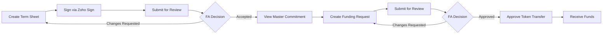
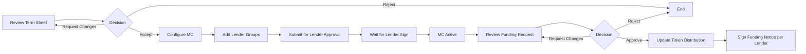
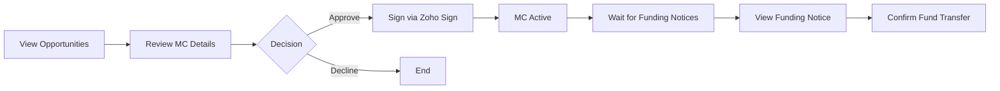
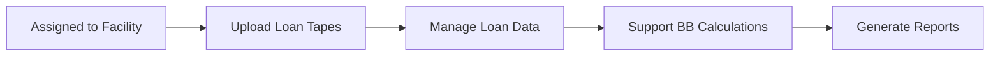

## User Roles in Credit Facility

The Credit Facility workflow involves four distinct user roles, each with specific responsibilities and permissions.

---

## Role Overview

<AccordionGroup>
  <Accordion title="Issuer (Borrower)" icon="building">
    The **Issuer** or **Borrower** is the entity seeking credit facility funding.
    
    **Key Responsibilities:**
    - Create and sign term sheets via Zoho Sign
    - Submit funding requests against active commitments
    - Approve FT token transfers
    - Map loans to credit facilities
    - Receive funds from lenders
    
    **Dashboard Access:**
    - Term Sheet list and status
    - Master Commitment details (after approval)
    - Funding Request management
    - Funding Notice tracking
  </Accordion>
  
  <Accordion title="Facility Agent (Underwriter)" icon="user-tie">
    The **Facility Agent** manages the credit facility on behalf of all parties.
    
    **Key Responsibilities:**
    - Review and approve/reject term sheets
    - Configure master commitments with lender groups
    - Set collateral eligibility rules
    - Review and approve funding requests
    - Sign funding notices for each lender via Zoho Sign
    - Monitor facility performance and capacity
    
    **Dashboard Access:**
    - Term Sheets pending review
    - Master Commitments (setup and active)
    - Funding Requests pending approval
    - Funding Notices for signing
  </Accordion>
  
  <Accordion title="Lender (Investor)" icon="landmark">
    **Lenders** provide funding against master commitments.
    
    **Key Responsibilities:**
    - Review master commitment opportunities
    - Approve commitments via Zoho Sign
    - View issued funding notices (after borrower approval)
    - Confirm fund transfers to borrowers
    - Track token allocations and distributions
    
    **Dashboard Access:**
    - Opportunities (pending approval)
    - My Facilities (active commitments)
    - Funding Notices (after borrower approval)
  </Accordion>
  
  <Accordion title="Servicer" icon="gears">
    **Servicers** manage the ongoing loan portfolio.
    
    **Key Responsibilities:**
    - Upload monthly loan tapes
    - Manage loan data and performance tracking
    - Support borrowing base calculations
    
    **Dashboard Access:**
    - Assigned facilities
    - Loan tape upload interface
    - Performance reporting
  </Accordion>
</AccordionGroup>

---

## Permission Matrix

The following matrix shows which actions each role can perform in the Credit Facility workflow:

| Action | Issuer | Facility Agent | Lender | Servicer |
|--------|--------|----------------|--------|----------|
| **Term Sheet** |
| Create Term Sheet | ✅ | ❌ | ❌ | ❌ |
| Sign Term Sheet (Zoho Sign) | ✅ | ❌ | ❌ | ❌ |
| Submit Term Sheet | ✅ | ❌ | ❌ | ❌ |
| Review Term Sheet | ❌ | ✅ | ❌ | ❌ |
| Accept/Reject Term Sheet | ❌ | ✅ | ❌ | ❌ |
| Request Changes (Term Sheet) | ❌ | ✅ | ❌ | ❌ |
| **Master Commitment** |
| Configure Master Commitment | ❌ | ✅ | ❌ | ❌ |
| Add Lender Groups | ❌ | ✅ | ❌ | ❌ |
| Set Collateral Rules | ❌ | ✅ | ❌ | ❌ |
| Submit for Lender Approval | ❌ | ✅ | ❌ | ❌ |
| Approve Master Commitment | ❌ | ❌ | ✅ | ❌ |
| Sign MC (Zoho Sign) | ❌ | ❌ | ✅ | ❌ |
| **Funding Request** |
| Create Funding Request | ✅ | ❌ | ❌ | ❌ |
| Upload Collateral Addendum | ✅ | ❌ | ❌ | ❌ |
| Submit Funding Request | ✅ | ❌ | ❌ | ❌ |
| Review Funding Request | ❌ | ✅ | ❌ | ❌ |
| Approve/Reject Funding Request | ❌ | ✅ | ❌ | ❌ |
| Request Changes (Funding Request) | ❌ | ✅ | ❌ | ❌ |
| **Funding Notice** |
| Update Token Distribution | ❌ | ✅ | ❌ | ❌ |
| Sign Funding Notice (Zoho Sign) | ❌ | ✅ | ❌ | ❌ |
| Approve Token Transfer | ✅ | ❌ | ❌ | ❌ |
| View Funding Notice | ❌ | ❌ | ✅ | ❌ |
| Confirm Fund Transfer | ❌ | ❌ | ✅ | ❌ |
| **Loan Management** |
| Map Loans to Commitment | ✅ | ❌ | ❌ | ❌ |
| Upload Loan Tapes | ❌ | ❌ | ❌ | ✅ |
| View Borrowing Base | ✅ | ✅ | ✅ | ✅ |
| View Reports | ✅ | ✅ | ✅ | ✅ |

---

## Role-Specific Workflows

### Issuer Workflow

### Facility Agent Workflow

### Lender Workflow

### Servicer Workflow

---

## Credit Facility Dashboard Screenshots

### Issuer Dashboard

### Facility Agent Dashboard

### Lender Dashboard

### Servicer Dashboard

---

## Next Steps

<CardGroup cols={2}>
  <Card title="Term Sheet Guide" icon="file-contract" href="/user-guide/credit-facility/term-sheet">
    Start with creating your first term sheet
  </Card>
  <Card title="Workflow Overview" icon="diagram-project" href="/user-guide/credit-facility/overview">
    Understand the complete credit facility workflow
  </Card>
</CardGroup>

