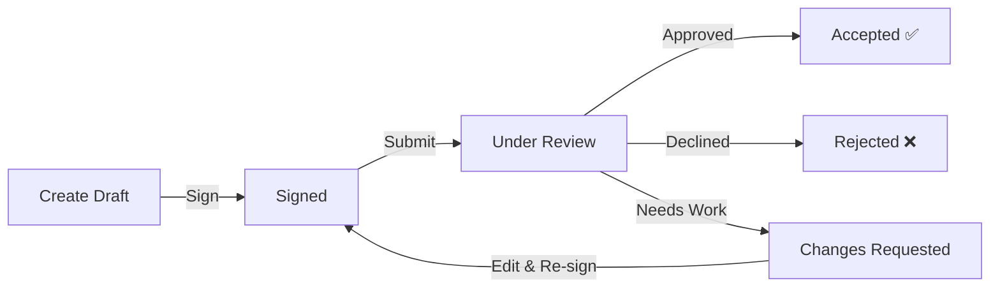
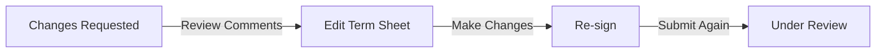

## What is a Term Sheet?

The **Term Sheet** is your starting point for obtaining a credit facility. It's the document where you outline what you need—how much funding, the interest rate terms, and when the facility should mature. Think of it as your application for the credit facility.

<Info>
**Good to Know:** When your term sheet is approved by the Facility Agent, a Master Commitment is automatically created for you. This moves your request to the next stage.
</Info>

---

## Term Sheet Journey

Here's how your term sheet progresses through the system:

---

## Step-by-Step Guide

### Step 1: Access the Platform

<Steps>
  <Step title="Login to Intain Markets">
    Go to [Intain Markets](https://intainmarkets.us/) and sign in with your credentials.
  </Step>
  <Step title="Navigate to Credit Facility">
    From your dashboard, find and click on the **Credit Facility** section.
  </Step>
  <Step title="Start a New Term Sheet">
    Click **"Create New Term Sheet"** to begin.
  </Step>
</Steps>

### Step 2: Fill in Your Details

Complete the form with your credit facility requirements:

<AccordionGroup>
  <Accordion title="Required Information" icon="asterisk" defaultOpen>
    | Field | What to Enter |
    |-------|--------------|
    | **Requested Amount** | How much funding you need (e.g., $50,000,000) |
    | **Advance Rate** | The loan-to-value percentage (e.g., 85%) |
    | **Margin** | Interest rate spread above the index (e.g., 2.5%) |
    | **Pricing Index** | The benchmark rate (SOFR, Prime Rate, or Fixed) |
    | **Maturity Date** | When the facility ends |
    | **Draw Frequency** | How often you can request funds (Monthly, Quarterly, On Demand) |
  </Accordion>
  
  <Accordion title="Optional Information" icon="circle-plus">
    | Field | What to Enter |
    |-------|--------------|
    | **Fixed Rate** | If using fixed pricing instead of floating rate |
    | **Covenant Template** | Standard terms template (e.g., Commercial, Real Estate) |
  </Accordion>
</AccordionGroup>

<Tip>
**Auto-Save:** Your changes are automatically saved as you work. You can leave and come back anytime while in Draft status.
</Tip>

### Step 3: Upload Supporting Documents

Upload documents to support your term sheet request:

| Document Type | Purpose |
|--------------|---------|
| **Collateral Profile** | Overview of your collateral portfolio |
| **Financial Statements** | Your recent financial reports |
| **KYC Documents** | Know Your Customer compliance documents |
| **Collateral Data** | Detailed information about your collateral |
| **Funding Sheet** | Your funding requirements breakdown |

<Steps>
  <Step title="Select Document Type">
    Choose the type of document from the dropdown menu.
  </Step>
  <Step title="Choose Your File">
    Click to select the file from your computer. Supported formats: PDF, DOC, DOCX, XLS, XLSX.
  </Step>
  <Step title="Upload">
    The file is securely uploaded and linked to your term sheet.
  </Step>
</Steps>

### Step 4: Sign Your Term Sheet

Before you can submit, you need to sign your term sheet electronically:

<Steps>
  <Step title="Click Sign Term Sheet">
    When your term sheet is complete, click the **"Sign Term Sheet"** button.
  </Step>
  <Step title="Complete Zoho Sign">
    You'll be redirected to Zoho Sign's secure interface. Review the document and apply your electronic signature.
  </Step>
  <Step title="Return to Platform">
    After signing, you'll be automatically redirected back to the platform.
  </Step>
</Steps>

<Note>
Your term sheet status changes to **"Signed"** after you complete the electronic signature. The signed document is securely stored.
</Note>

### Step 5: Submit for Review

Once signed, you can submit your term sheet to the Facility Agent:

<Steps>
  <Step title="Review Your Term Sheet">
    Click **"Preview"** to review all your information one last time.
  </Step>
  <Step title="Submit">
    Click **"Submit for Review"** to send it to the Facility Agent.
  </Step>
  <Step title="Confirmation">
    Your status changes to **"Under Review"** and the Facility Agent is notified.
  </Step>
</Steps>

<Warning>
**Before You Submit:** Make sure everything is correct! Once submitted, you cannot make changes until the Facility Agent either approves, rejects, or requests changes.
</Warning>

---

## What Happens After Submission?

### The Facility Agent's Decision

The Facility Agent will review your term sheet and take one of three actions:

<Tabs>
  <Tab title="Approved ✅">
    **Great News!**
    
    Your term sheet is approved and:
    - Status changes to **"Accepted"**
    - A **Master Commitment** is automatically created
    - You'll receive a notification
    - You can now track your Master Commitment status
    
    <Card title="Next Step" icon="arrow-right" href="/user-guide/credit-facility/master-commitment">
      Learn about Master Commitment configuration
    </Card>
  </Tab>
  
  <Tab title="Rejected ❌">
    **Request Declined**
    
    If rejected:
    - Status changes to **"Rejected"**
    - The rejection reason is documented
    - This is a final state—no further changes allowed
    
    **What to Do:** Review the rejection reason and, if appropriate, create a new term sheet addressing the concerns.
  </Tab>
  
  <Tab title="Changes Requested 🔄">
    **Revisions Needed**
    
    If changes are requested:
    - Status changes to **"Changes Requested"**
    - You'll see comments explaining what needs to change
    - You can now edit your term sheet again
    - Auto-save is re-enabled
    
    **What to Do:** Make the requested changes, re-sign via Zoho Sign, and resubmit.
  </Tab>
</Tabs>

---

## Handling Change Requests

If the Facility Agent requests changes, follow this process:

<Steps>
  <Step title="Review the Feedback">
    Check the Facility Agent's comments to understand what changes are needed.
  </Step>
  <Step title="Edit Your Term Sheet">
    Make the requested modifications. Your changes save automatically.
  </Step>
  <Step title="Re-sign">
    After editing, you must sign again via Zoho Sign.
  </Step>
  <Step title="Resubmit">
    Submit the revised term sheet for another review.
  </Step>
</Steps>

<Info>
**Version History:** Don't worry about losing your previous work. Each revision is saved automatically, maintaining a complete history of changes.
</Info>

---

## Understanding Your Status

| Status | What It Means | Can You Edit? | What's Next? |
|--------|--------------|---------------|--------------|
| **Draft** | You're working on it | ✅ Yes | Sign when ready |
| **Signed** | You've signed, ready to submit | ❌ No | Submit for review |
| **Under Review** | Facility Agent is reviewing | ❌ No | Wait for decision |
| **Accepted** | Approved! | ❌ No | Master Commitment created |
| **Rejected** | Declined | ❌ No | Create new term sheet |
| **Changes Requested** | Revisions needed | ✅ Yes | Edit and resubmit |

---

## Common Questions

<AccordionGroup>
  <Accordion title="Why can't I edit my term sheet?" icon="lock">
    You can only edit when status is **Draft** or **Changes Requested**. If your term sheet is under review or has been decided, you cannot make changes.
    
    **Solution:** 
    - If rejected, create a new term sheet
    - If awaiting review, wait for the Facility Agent's decision
  </Accordion>
  
  <Accordion title="I'm having trouble with the electronic signature" icon="signature">
    If you're having issues with Zoho Sign:
    - Check your email for any Zoho Sign notifications
    - Try using a different browser
    - Ensure you have a stable internet connection
    - Contact support if the issue persists
  </Accordion>
  
  <Accordion title="My document upload failed" icon="upload">
    If documents won't upload:
    - Check the file format (PDF, DOC, DOCX, XLS, XLSX)
    - Verify the file isn't too large
    - Try a different file
    - Ensure stable internet connection
  </Accordion>
  
  <Accordion title="I submitted but want to make changes" icon="pen">
    Once submitted, you cannot make changes until the Facility Agent reviews your request. They may:
    - Approve it (no changes needed)
    - Request changes (you can then edit)
    - Reject it (you'd need to start a new one)
  </Accordion>
</AccordionGroup>

---

## Next Steps

After your term sheet is accepted:

<Card title="Master Commitment Configuration" icon="handshake" href="/user-guide/credit-facility/master-commitment">
  Learn how the Facility Agent sets up your Master Commitment with lender groups and collateral rules, and how lenders approve it.
</Card>
