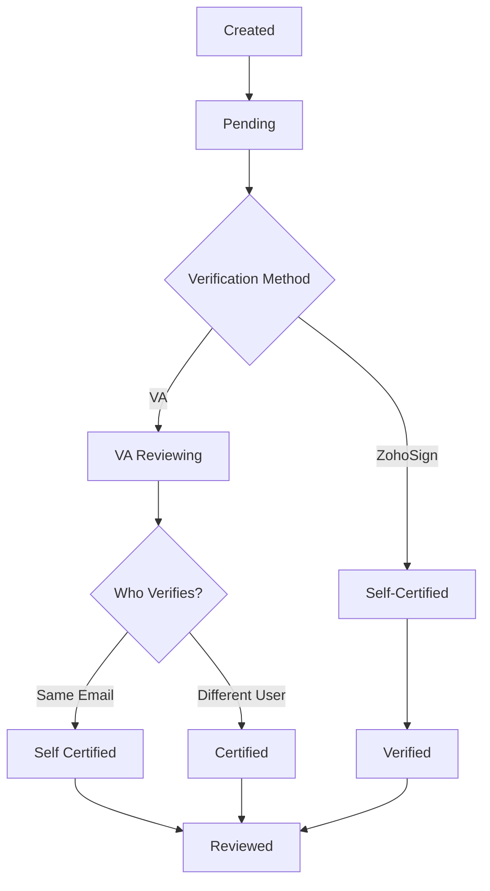

# Batch Management

Batches are collections of loans grouped together for efficient verification. This guide covers everything you need to know about creating, managing, and tracking batches through the verification process.

## What is a Batch?

A **Batch** is a group of loans that are verified together. Batches streamline the verification process by allowing you to:

- Organize loans logically (by date, asset class, pool, etc.)
- Submit multiple loans for verification at once
- Track verification status for groups of loans
- Generate certificates for multiple loans together

**Batch ID Format:**
```
[OrgCode][Date][Sequence]
Example: ABC241201001
```
- **OrgCode**: First 3 letters of issuer organization name
- **Date**: DDMMYY format (e.g., 241201 = December 1, 2024)
- **Sequence**: 3-digit sequence number (001, 002, etc.)

## Batch Status Lifecycle

Batches progress through different statuses as they move through verification:



| Status | Description | What Happens Next |
|--------|-------------|-------------------|
| **Pending** | Batch created, awaiting verification | Choose verification method |
| **Verified** | Batch verified (self-certified) | Ready for NFT minting |
| **Reviewed** | Batch reviewed by VA | Ready for NFT minting |

## Creating a Batch

### Step 1: Access Loan Registry

Navigate to the **Loan Registry** tab to view your onboarded loans.

<Frame caption="Loan Registry Tab">
  
</Frame>

### Step 2: Select Loans

<Steps>
  <Step title="Filter Loans (Optional)">
    Use filters to narrow down loans:
    - **Asset Class**: Filter by loan type
    - **As Of Date**: Filter by snapshot date
    - **Status**: Filter by workflow status
    - **Batch**: Filter by existing batch or loans without batch
    - **Pool**: Filter by pool or unmapped loans
  </Step>
  
  <Step title="Select Individual Loans">
    - Check the checkbox next to each loan you want to include
    - Selected loans are highlighted
    - Selection count is displayed
    - **Note**: Loans already in a batch or mapped to a pool will have disabled checkboxes
  </Step>
  
  <Step title="Select All (Optional)">
    - Click **Select All** to include all filtered loans
    - Only eligible loans (not in batch/pool) will be selected
    - Useful for bulk operations
    - Can deselect individual loans after selecting all
  </Step>
</Steps>

<Warning>
  **Eligibility Rules**: 
  - Only loans with `workflow_status: "STANDARDISED"` can be added to a batch
  - Loans already in a batch **cannot** be added to another batch
  - Loans already mapped to a pool **cannot** be added to a batch
  - The **Add to Batch** button will be **disabled** for ineligible loans
</Warning>

### Step 3: Create Batch

<Steps>
  <Step title="Click Create Batch">
    After selecting loans, click the **Create Batch** button.
  </Step>
  
  <Step title="Enter Batch Details">
    Provide batch information:
    - **Batch Name** (optional): Descriptive name for your reference
    - **Originator Name**: Source of the loans
    - **Asset Class**: Type of loans in batch
  </Step>
  
  <Step title="Choose Verification Method">
    Select how this batch will be verified:
    - **Self-Certification**: You will certify via ZohoSign
    - **VA Verification**: Submit to Verification Agent
  </Step>
  
  <Step title="Confirm Creation">
    Click **Create** to generate the batch.
  </Step>
</Steps>

**What Happens:**
1. System generates unique Batch ID
2. Loans are assigned to the batch (`batchid` field updated)
3. Loan status changes: `workflow_status: "STANDARDISED"` → `"SUBMITTED"`
4. Batch status set to: `status: "Pending"`, `batchverified: "NO"`
5. Batch appears in Batch Verification tab

<Frame caption="Batch Verification Tab">
  
</Frame>

## Viewing Batch Details

Click on any batch to view comprehensive details:

**Batch Information:**
- Batch ID and name
- Creation date and time
- Number of loans in batch
- Current status
- Verification source
- Certificate details (if verified)

**Loan List:**
- All loans included in the batch
- Individual loan statuses
- Loan details and data
- Actions available for each loan

## Batch Status Fields

Understanding batch status fields helps track progress:

<Tabs>
  <Tab title="status">
    | Value | Description |
    |-------|-------------|
    | **Pending** | Batch created, awaiting verification |
    | **Verified** | Batch verified (self-certified) |
    | **Reviewed** | Batch reviewed by VA |
  </Tab>
  
  <Tab title="batchverified">
    | Value | Description |
    |-------|-------------|
    | **NO** | Batch not yet verified |
    | **Yes** | Batch verification completed |
  </Tab>
  
  <Tab title="verificationSource">
    | Value | Description |
    |-------|-------------|
    | **No** | No verification method assigned |
    | **Self Certified** | Issuer self-certified (manual) |
    | **Certified** | Verified by VA |
    | **Self Certified (Data Only)** | Self-certified via ZohoSign |
  </Tab>
</Tabs>

## Managing Batches

### View All Batches

The **Batch Verification** tab shows all your batches:

**Batch List View:**
- Batch ID and name
- Loan count
- Status
- Creation date
- Verification source
- Actions available

**Filtering Options:**
- Filter by status (Pending, Verified, Reviewed)
- Filter by verification source
- Filter by date range
- Search by Batch ID

### Batch Actions

Available actions depend on batch status:

| Action | When Available | Description |
|--------|----------------|-------------|
| **View Details** | Always | View batch and loan details |
| **Self-Certify** | Status: Pending | Initiate ZohoSign self-certification |
| **Submit to VA** | Status: Pending | Send batch to Verification Agent |
| **View Certificate** | Status: Verified/Reviewed | Download VA certificate |
| **Mint NFTs** | Status: Verified/Reviewed | Create NFT certificates |

## Batch Verification Methods

### Method 1: Self-Certification

**When to Use:**
- Issuer wants to certify their own loans
- Quick verification process needed
- No third-party verification required

**Process:**
1. Select batch with status "Pending"
2. Click **Self-Certify** or **ZohoSign Certify**
3. System generates certification document
4. ZohoSign interface opens for signing
5. Sign document electronically
6. Batch status updates to "Verified"
7. Loans status updates to "VERIFIED"

**Status Updates:**
- Batch: `batchverified: "Yes"`, `verificationSource: "Self Certified (Data Only)"`
- Loans: `workflow_status: "VERIFIED"`, `verificationSource: "Self Certified (Data Only)"`

### Method 2: VA Verification

**When to Use:**
- Third-party verification required
- Regulatory compliance needs
- Investor requirements

**Process:**
1. Select batch with status "Pending"
2. Click **Submit to VA**
3. Select Verification Agent
4. Batch assigned to VA
5. VA receives notification
6. VA reviews and verifies
7. VA certificate generated
8. Batch status updates to "Reviewed"
9. Loans status updates to "VERIFIED"

**Status Updates:**
- Batch: `batchverified: "Yes"`, `verificationSource: "Certified"`, `status: "Reviewed"`
- Loans: `workflow_status: "VERIFIED"`, `verificationSource: "Certified"`

## Loan Status Updates

When loans are added to a batch, their status changes:

**Before Batch:**
- `workflow_status: "STANDARDISED"`
- `batchid: null` or empty

**After Batch Creation:**
- `workflow_status: "SUBMITTED"`
- `batchid: <batchId>`

**After Verification:**
- `workflow_status: "VERIFIED"`
- `verificationSource: "Self Certified"` or `"Certified"` or `"Self Certified (Data Only)"`

## Batch Best Practices

<CardGroup cols={2}>
  <Card title="Logical Grouping" icon="layer-group">
    Group loans by:
    - Same asset class
    - Same origination period
    - Same pool or deal
    - Similar characteristics
  </Card>
  
  <Card title="Batch Size" icon="list-ol">
    - Optimal size: 50-200 loans per batch
    - Too small: Inefficient processing
    - Too large: Difficult to manage
  </Card>
  
  <Card title="Naming Convention" icon="tag">
    Use descriptive batch names:
    - Include asset class
    - Include date or period
    - Include purpose (e.g., "Q4 Auto Loans")
  </Card>
  
  <Card title="Verification Planning" icon="calendar-check">
    - Plan verification method in advance
    - Consider VA availability for VA verification
    - Allow time for VA review process
  </Card>
</CardGroup>

## Troubleshooting

### Common Issues

<Tabs>
  <Tab title="Cannot Create Batch">
    **Issue**: Create Batch button disabled or loans not selectable
    
    **Solutions**:
    - Ensure loans have `workflow_status: "STANDARDISED"`
    - Check that loans are not already in another batch
    - Verify loans are not already verified
    - Refresh the page and try again
  </Tab>
  
  <Tab title="Batch Status Not Updating">
    **Issue**: Batch status remains "Pending" after verification
    
    **Solutions**:
    - Check verification process completed successfully
    - Verify ZohoSign signing completed
    - Check VA verification was submitted
    - Refresh page to see latest status
    - Contact support if issue persists
  </Tab>
  
  <Tab title="Loans Missing from Batch">
    **Issue**: Expected loans not appearing in batch
    
    **Solutions**:
    - Verify loans were selected before batch creation
    - Check loan filters applied correctly
    - Review batch details to see included loans
    - Create new batch if loans were missed
  </Tab>
</Tabs>

---

<CardGroup cols={2}>
  <Card title="Previous: Loan Onboarding" icon="arrow-left" href="/user-guide/loan-onboarding/loan-onboarding">
    Go back to loan onboarding
  </Card>
  
  <Card title="Next: Verification Flow" icon="arrow-right" href="/user-guide/loan-onboarding/verification-flow">
    Learn about verification processes
  </Card>
</CardGroup>

