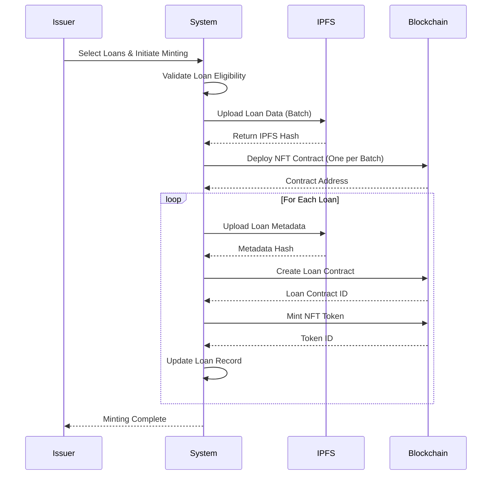

# NFT Minting

After loans are verified, you can mint Non-Fungible Token (NFT) certificates on the blockchain. NFTs provide immutable, verifiable proof of loan ownership and data integrity.

## What is NFT Minting?

NFT minting creates unique blockchain tokens representing verified loans. Each NFT:

- **Represents One Loan**: One NFT per verified loan
- **Contains Metadata**: Loan details and IPFS hash
- **Immutable Record**: Cannot be altered once minted
- **Ownership Tracking**: Clear ownership on blockchain
- **Verifiable**: Anyone can verify loan data via blockchain

## Prerequisites for NFT Minting

Before minting NFTs, ensure:

<CardGroup cols={2}>
  <Card title="Loans Verified" icon="shield-check">
    Loans must have `workflow_status: "VERIFIED"`
  </Card>
  
  <Card title="Batch Verified" icon="check-circle">
    Batch must have `batchverified: "Yes"`
  </Card>
  
  <Card title="Wallet Configured" icon="wallet">
    Issuer wallet address must be configured
  </Card>
  
  <Card title="Sufficient Balance" icon="coins">
    Blockchain network fees must be covered
  </Card>
</CardGroup>

## NFT Minting Process

### Step 1: Access Certificates Tab

Navigate to the **Certificates** tab from your Issuer dashboard.

<Frame caption="Certificates Tab">
  
</Frame>

### Step 2: Select Loans for NFT Minting

You can mint NFTs in two ways:

**Option A: Mint by Batch**
- Select a verified batch
- All loans in the batch are eligible for NFT minting
- Click **Mint NFTs** for the batch

**Option B: Mint Individual Loans**
- Navigate to loan details
- Select specific loans for NFT minting
- Loans must be verified to be eligible

<Frame caption="View Loans by Batch or NFT Status">
  
</Frame>

### Step 3: Review Loan Eligibility

The system shows which loans are eligible:

**Eligible Loans:**
- `workflow_status: "VERIFIED"`
- `nftLoanStatus: "Not Minted"`
- Part of verified batch

**Already Minted Loans:**
- `nftLoanStatus`: Has minted status
- Shows token ID and contract address
- Cannot be minted again

### Step 4: Initiate NFT Minting

<Steps>
  <Step title="Select Loans">
    Choose loans to mint:
    - Select individual loans, or
    - Select entire batch, or
    - Use "Select All" for filtered loans
  </Step>
  
  <Step title="Click Mint NFTs">
    Click the **Mint NFTs** or **Create NFTs** button.
  </Step>
  
  <Step title="Confirm Selection">
    Review the selection:
    - Number of loans to mint
    - Loan IDs included
    - Estimated gas fees (if applicable)
  </Step>
  
  <Step title="Start Minting">
    Click **Confirm** to begin the minting process.
  </Step>
</Steps>

<Frame caption="NFT Minting Interface">
  
</Frame>

## NFT Minting Workflow

The minting process happens in several stages:

### Stage 1: Data Preparation

**Loan Data Upload to IPFS:**
- All loan data uploaded to IPFS in batch
- IPFS hash generated for loan details
- Data stored immutably on IPFS network

**Metadata Preparation:**
- Loan metadata prepared for each loan
- Includes loan details, IPFS hash, certificate hash
- Formatted for blockchain storage

### Stage 2: Contract Deployment

**NFT Contract Deployment:**
- One NFT contract deployed per batch
- Contract address generated
- Contract ready for token minting

**Contract Details:**
- Contract address stored in batch record
- Used for all NFTs in the batch
- Enables efficient batch management

### Stage 3: Sequential NFT Minting

**For Each Loan (Sequential Processing):**

1. **Upload Metadata to IPFS**
   - Loan metadata uploaded
   - IPFS hash generated
   - Token URI created

2. **Create Loan Contract**
   - Loan contract created on blockchain
   - Links to IPFS hash
   - Transaction ID recorded

3. **Mint NFT Token**
   - Unique token ID generated (random uint256)
   - NFT minted to issuer wallet
   - Token ID recorded

4. **Update Loan Record**
   - `nftLoanStatus`: Updated from "Not Minted"
   - `tokenId`: NFT token ID stored
   - `contractAddress`: NFT contract address stored
   - `tokenURI`: IPFS metadata URI stored
   - `ipfsHash`: IPFS hash stored
   - `transactionId`: Blockchain transaction ID stored

**Sequential Processing:**
- Loans processed one at a time
- Prevents blockchain nonce conflicts
- Ensures reliable minting
- Progress tracked in real-time

### Stage 4: Completion

**After All Loans Minted:**
- Success summary displayed
- Number of NFTs minted
- Failed loans (if any) reported
- Loan records updated

## NFT Structure

### Token Details

Each NFT contains:

| Field | Description |
|-------|-------------|
| **Token ID** | Unique identifier (random uint256) |
| **Contract Address** | NFT contract address (one per batch) |
| **Token URI** | IPFS metadata URI |
| **Owner** | Issuer wallet address (initially) |
| **Metadata** | Loan details stored in IPFS |

### Metadata Contents

NFT metadata (stored in IPFS) includes:

- Loan ID
- Loan details (balances, rates, dates)
- Verification certificate hash
- IPFS hash for full loan data
- Minting date and transaction ID
- Issuer information

## Viewing Minted NFTs

### From Certificates Tab

1. Navigate to **Certificates** tab
2. View batches with minted NFTs
3. Click to see NFT details:
   - Token ID
   - Contract address
   - Transaction ID
   - IPFS hash
   - Loan details

### From Loan Registry

1. Navigate to **Loan Registry** tab
2. Filter by `nftLoanStatus` (not "Not Minted")
3. View individual loan NFT details
4. Access blockchain explorer links

<Frame caption="View NFT Details">
  
</Frame>

## NFT Status Tracking

### Loan NFT Status

| Status | Description |
|--------|-------------|
| **Not Minted** | Loan verified but NFT not yet minted |
| **Minting** | NFT minting in progress |
| **Minted** | NFT successfully minted (shows token ID) |
| **Failed** | NFT minting failed (can retry) |

### Batch NFT Status

- **All Minted**: All loans in batch have NFTs
- **Partial**: Some loans minted, others pending
- **Not Started**: No NFTs minted yet

## NFT Best Practices

<CardGroup cols={2}>
  <Card title="Batch Minting" icon="layer-group">
    - Mint entire batches together for efficiency
    - One contract per batch reduces gas costs
    - Easier to track and manage
  </Card>
  
  <Card title="Verification First" icon="shield-check">
    - Always verify loans before minting
    - Ensures data accuracy in NFTs
    - Required for NFT eligibility
  </Card>
  
  <Card title="Wallet Management" icon="wallet">
    - Ensure wallet has sufficient balance
    - Keep wallet credentials secure
    - Monitor gas fees
  </Card>
  
  <Card title="Record Keeping" icon="file-alt">
    - Save NFT details (token ID, contract address)
    - Keep transaction IDs for reference
    - Document IPFS hashes
  </Card>
</CardGroup>

## Troubleshooting

### Common Issues

<Tabs>
  <Tab title="Minting Fails">
    **Issue**: NFT minting fails for some loans
    
    **Solutions**:
    - Check loan verification status
    - Verify wallet has sufficient balance
    - Check blockchain network connectivity
    - Retry minting for failed loans
    - Contact support if issue persists
  </Tab>
  
  <Tab title="Status Not Updating">
    **Issue**: Loan status shows "Not Minted" after minting
    
    **Solutions**:
    - Wait for blockchain confirmation
    - Refresh the page
    - Check transaction status on blockchain explorer
    - Verify minting completed successfully
  </Tab>
  
  <Tab title="Gas Fees Too High">
    **Issue**: Estimated gas fees are very high
    
    **Solutions**:
    - Mint smaller batches
    - Wait for lower network congestion
    - Consider minting during off-peak hours
    - Check current gas prices
  </Tab>
</Tabs>

## NFT Verification

### Verifying NFTs on Blockchain

**Using Token ID:**
1. Navigate to blockchain explorer
2. Enter contract address
3. Enter token ID
4. View NFT details and metadata

**Using IPFS Hash:**
1. Access IPFS gateway
2. Enter IPFS hash
3. View loan data and metadata
4. Verify data integrity

### NFT Ownership

**Initial Ownership:**
- NFTs minted to issuer wallet
- Issuer is the owner initially

**Transfer Ownership:**
- NFTs can be transferred to other wallets
- Transfer recorded on blockchain
- Ownership history maintained

---

<CardGroup cols={2}>
  <Card title="Previous: Verification Flow" icon="arrow-left" href="/user-guide/loan-onboarding/verification-flow">
    Go back to verification flow
  </Card>
  
  <Card title="Next: VA Operations" icon="arrow-right" href="/user-guide/loan-onboarding/va-operations">
    Learn about VA dashboard and workflows
  </Card>
</CardGroup>

