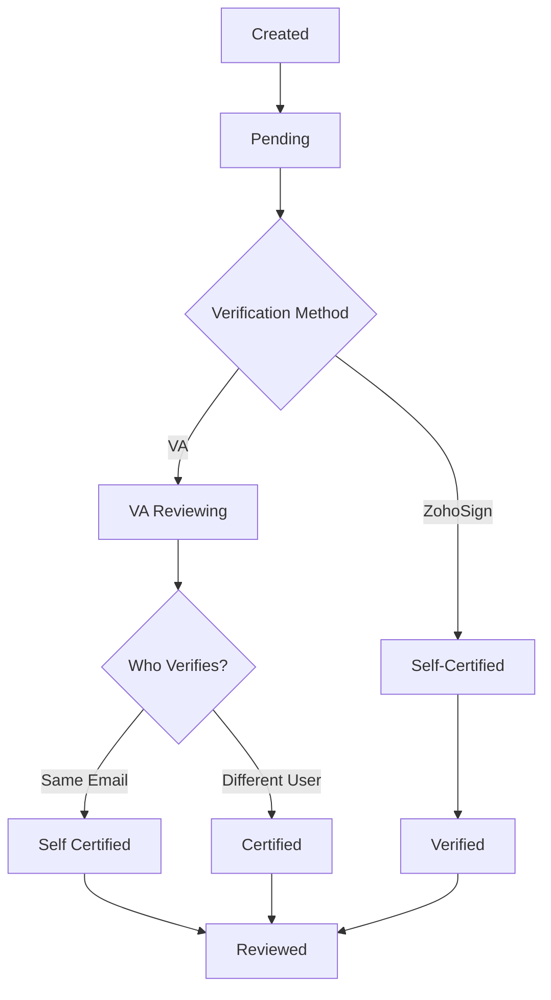
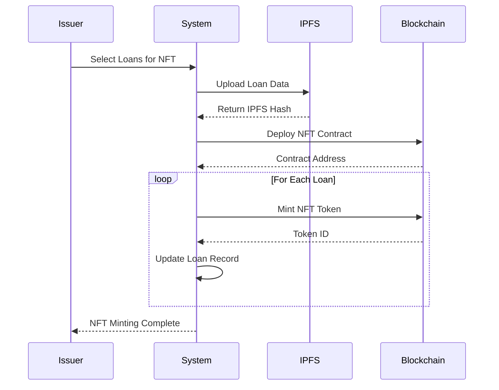
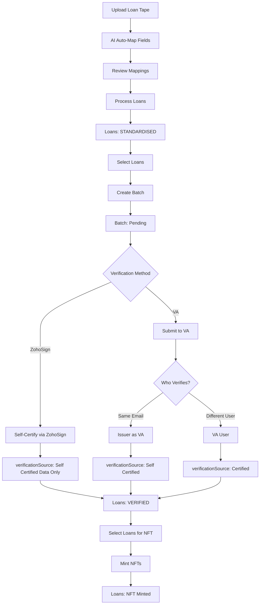
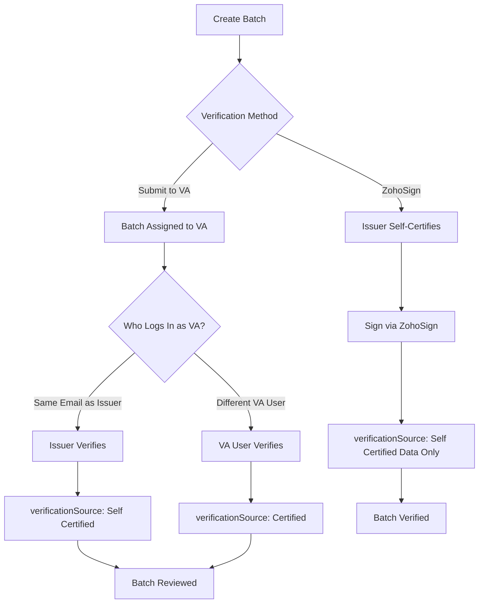

# Loan Onboarding Workflow Overview

This section provides a comprehensive understanding of how loan onboarding, verification, and NFT minting works on the Intain Markets platform. The workflow involves multiple stages from initial upload to final blockchain tokenization.

## End-to-End Loan Onboarding Flow

The loan onboarding process follows a structured workflow with clear stages and status transitions:


## Key Concepts

<AccordionGroup>
  <Accordion title="Loan Tape">
    A **Loan Tape** is a data file (Excel or CSV) containing loan information:
    - **Format**: Excel (.xlsx, .xls) or CSV files
    - **Content**: Loan identifiers, balances, rates, borrower info, collateral details
    - **As Of Date**: Snapshot date for the loan data
    - **Processing**: Standardized to common format for platform use
    
    After upload, loans are stored in the issuer's database with status `"STANDARDISED"`.
  </Accordion>
  
  <Accordion title="Field Mapping">
    **Field Mapping** converts loan tape columns to standard platform fields:
    - **Auto-Mapping**: AI-powered automatic field detection
    - **Manual Adjustment**: Review and correct mappings as needed
    - **Standard Fields**: Platform-defined field names (e.g., "Loan ID", "Current Principal Balance")
    - **Unmapped Columns**: Preserved for reference but not standardized
    
    Mapping ensures consistency across different loan tape formats.
  </Accordion>
  
  <Accordion title="Batch">
    A **Batch** is a collection of loans grouped for verification:
    - **Purpose**: Organize loans for efficient verification
    - **Batch ID**: Unique identifier (format: `[OrgCode][Date][Sequence]`)
    - **Status**: Tracks verification progress (Pending → Verified → Reviewed)
    - **Verification Source**: Self-Certified, Certified (VA), or Self-Certified (Data Only)
    
    Batches allow issuers to verify multiple loans together.
  </Accordion>
  
  <Accordion title="Verification">
    **Verification** confirms loan data accuracy:
    - **Self-Certification**: Issuer certifies their own loans via ZohoSign
    - **VA Verification**: Third-party Verification Agent reviews and certifies
    - **Certificate**: PDF document stored in IPFS with verification details
    - **Status Update**: Loans move from `"SUBMITTED"` to `"VERIFIED"`
    
    Verification is required before NFT minting.
  </Accordion>
  
  <Accordion title="NFT Certificate">
    **NFT (Non-Fungible Token)** certificates represent verified loans on blockchain:
    - **Uniqueness**: Each loan gets a unique NFT token
    - **Immutable**: Blockchain ensures data cannot be altered
    - **Metadata**: Contains loan details and IPFS hash
    - **Ownership**: Issuer owns the NFT initially
    
    NFTs enable transparent, verifiable loan ownership records.
  </Accordion>
</AccordionGroup>

## Workflow Stages Detailed

### Stage 1: Loan Upload & Processing

The Issuer initiates the process by uploading loan tape files.

**Key Actions:**
1. Upload loan tape file (Excel/CSV)
2. System auto-detects field names
3. AI-powered auto-mapping to standard fields
4. Review and adjust field mappings
5. Process loans to standardized format
6. Loans stored in issuer database

**Loan Status:** 
- `Status: "Unmapped"` (not yet mapped to pool)
- `workflow_status: "STANDARDISED"`
- `verificationSource: "No"`
- `nftLoanStatus: "Not Minted"`

<Frame caption="Issuer Dashboard - Imports Tab">
  
</Frame>

### Stage 2: Batch Creation

After loans are standardized, create batches for verification.

**Key Actions:**
1. Navigate to Loan Registry
2. Filter and select loans for batch
3. Create new batch with batch name
4. System generates unique Batch ID
5. Loans assigned to batch
6. Batch status set to "Pending"

**Batch Status Flow:**


**Loan Status Update:**
- `batchid`: Assigned batch identifier
- `workflow_status: "SUBMITTED"` (moved from "STANDARDISED")

<Frame caption="Issuer Dashboard - Batch Verification Tab">
  
</Frame>

### Stage 3: Verification

Choose verification method: Self-Certification or VA Verification.

#### Self-Certification (ZohoSign)

**Process:**
1. Select batch for self-certification
2. System generates certification document
3. ZohoSign embedded signing interface opens
4. Issuer signs the document electronically
5. Signed document downloaded and stored in IPFS
6. Batch status updated to "Verified"
7. Loans status updated to "VERIFIED"

**Status Updates:**
- Batch: `batchverified: "Yes"`, `verificationSource: "Self Certified (Data Only)"`
- Loans: `workflow_status: "VERIFIED"`, `verificationSource: "Self Certified (Data Only)"`

<Frame caption="Batch Self-Certification">
  
</Frame>

#### VA Verification

**Process:**
1. Submit batch to Verification Agent
2. VA receives notification
3. VA reviews loan data
4. VA compares with source documents
5. VA verifies batch
6. VA certificate generated and stored
7. Batch status updated to "Reviewed"
8. Loans status updated to "VERIFIED"

**Status Updates:**
- Batch: `batchverified: "Yes"`, `verificationSource: "Certified"`, `status: "Reviewed"`
- Loans: `workflow_status: "VERIFIED"`, `verificationSource: "Certified"`

### Stage 4: NFT Minting

After verification, mint NFT certificates for verified loans.

**Key Actions:**
1. Navigate to Certificates tab
2. Select verified batch or individual loans
3. Review loan details
4. Initiate NFT minting process
5. System uploads loan data to IPFS
6. NFT contract deployed (one per batch)
7. NFTs minted sequentially
8. Loan records updated with NFT details

**NFT Minting Process:**


**Status Updates:**
- Loans: `nftLoanStatus`: Updated from `"Not Minted"` to minted status
- NFT details stored: `tokenId`, `contractAddress`, `tokenURI`, `ipfsHash`

<Frame caption="NFT Minting - Certificates Tab">
  
</Frame>

## Status Reference Summary

<Tabs>
  <Tab title="Loan Status Fields">
    | Field | Values | Description |
    |-------|--------|-------------|
    | **Status** | `"Unmapped"`, `"Mapped"`, `<Pool Name>` | Mapping status to pool |
    | **workflow_status** | `"STANDARDISED"`, `"SUBMITTED"`, `"VERIFIED"` | Workflow progression |
    | **verificationSource** | `"No"`, `"Self Certified"`, `"Certified"`, `"Self Certified (Data Only)"` | Verification method |
    | **nftLoanStatus** | `"Not Minted"`, `<minted status>` | NFT minting status |
    | **loanPoolStatus** | `""`, `"Reconsider"`, `"Reinstated"`, `"Removed"` | Pool management status |
  </Tab>
  
  <Tab title="Batch Status Fields">
    | Field | Values | Description |
    |-------|--------|-------------|
    | **status** | `"Pending"`, `"Verified"`, `"Reviewed"` | Batch verification status |
    | **batchverified** | `"NO"`, `"Yes"` | Verification completion flag |
    | **verificationSource** | `"No"`, `"Self Certified"`, `"Certified"`, `"Self Certified (Data Only)"` | Verification method |
  </Tab>
</Tabs>

## Complete Status Flow

### Loan Status Flow:
```
Upload → Status: "Unmapped", workflow_status: "STANDARDISED", verificationSource: "No", nftLoanStatus: "Not Minted"
  ↓
Create Batch → workflow_status: "SUBMITTED", batchid: <batchId>
  ↓
Verify Batch → workflow_status: "VERIFIED", verificationSource: "Self Certified" | "Certified" | "Self Certified (Data Only)"
  ↓
Mint NFT → nftLoanStatus: <minted>, tokenId: <id>, contractAddress: <address>
```

### Batch Status Flow:
```
Create Batch → status: "Pending", batchverified: "NO", verificationSource: "No"
  ↓
Submit to VA / Self-Certify → (status remains "Pending")
  ↓
Verify Batch → status: "Verified" | "Reviewed", batchverified: "Yes", verificationSource: "Self Certified" | "Certified" | "Self Certified (Data Only)"
```

## Key Workflow Diagrams

### Complete Loan Onboarding Flow



### Verification Decision Tree



---

<Card title="Contact Support" icon="headset" href="mailto:support@intainft.com" target="_blank">
  Need help understanding the loan onboarding flow? Our support team is here to assist.
</Card>

