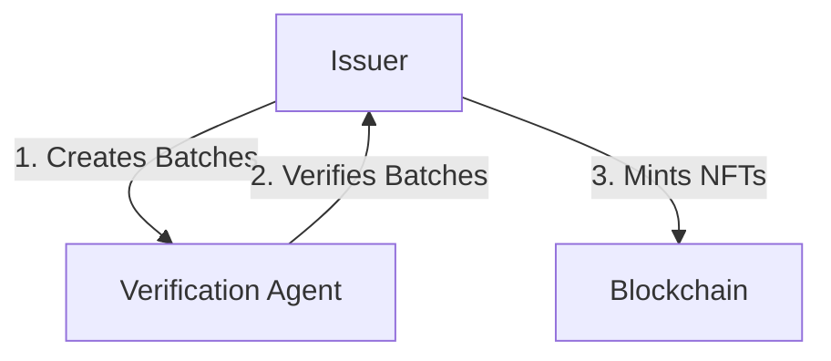
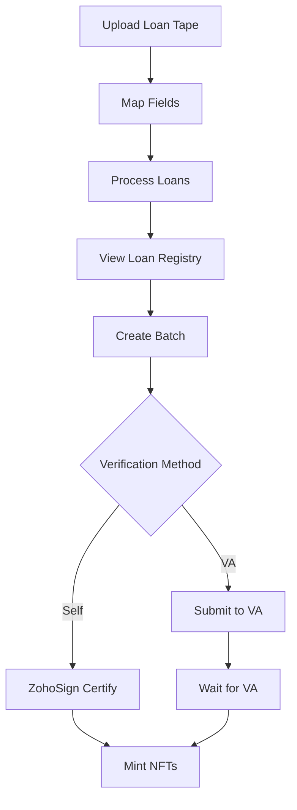
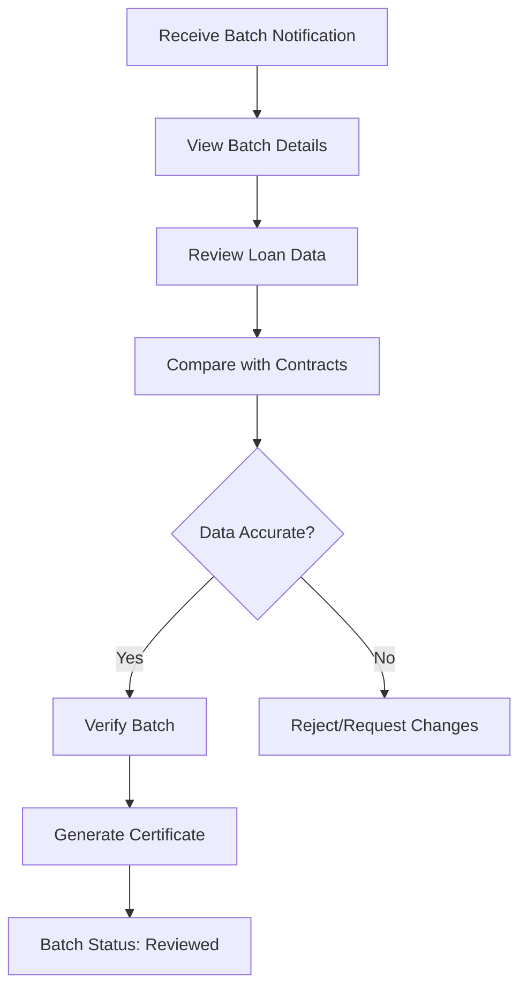

# Roles & Permissions

This section explains the different user roles involved in loan onboarding, verification, and NFT minting, along with their specific responsibilities and permissions.

## Platform Roles Overview

## Issuer

The **Issuer** is the organization that owns the loans and initiates the onboarding process.

**Key Responsibilities:**

| Action | Description |
|--------|-------------|
| Upload Loan Tapes | Import Excel/CSV files with loan data |
| Map Fields | Review and adjust auto-mapped fields to standard format |
| View Onboarded Loans | Access loan registry with all standardized loans |
| Create Batches | Group loans together for verification |
| Self-Certify | Sign certification documents via ZohoSign |
| Submit to VA | Send batches to Verification Agent for review |
| Mint NFTs | Create blockchain NFT certificates for verified loans |
| View Certificates | Access VA certificates and NFT details |

**Platform Access:**
- **Imports Tab**: Upload and process loan tapes
- **Loan Registry Tab**: View and manage onboarded loans
- **Batch Verification Tab**: Create and manage batches
- **Certificates Tab**: View certificates and mint NFTs

**Dashboard View:**

<Frame caption="Issuer Dashboard">
  
</Frame>

**Workflow:**

---

## Verification Agent (VA)

The **Verification Agent** is a third-party organization that reviews and certifies loan data accuracy.

**Key Responsibilities:**

| Action | Description |
|--------|-------------|
| View Batches | Access batches submitted by issuers |
| Review Loans | Compare loan data with source documents |
| Verify Batches | Confirm data accuracy and certify |
| Generate Certificates | Create VA certification documents |
| Download Contracts | Access loan contract files for review |
| Update Batch Status | Mark batches as verified or rejected |

**Platform Access:**
- **VA Dashboard**: View all assigned batches
- **Batch Details**: Review individual batch and loan data
- **Verification Interface**: Compare data and certify accuracy
- **Certificate Management**: Generate and download certificates

**Workflow:**

---

## Permission Matrix

The following matrix shows which actions each role can perform:

| Action | Issuer | Verification Agent |
|--------|:------:|:------------------:|
| Upload Loan Tapes | ✅ | ❌ |
| Map Fields | ✅ | ❌ |
| View Loan Registry | ✅ | ❌ |
| Create Batches | ✅ | ❌ |
| Self-Certify (ZohoSign) | ✅ | ❌ |
| Submit Batch to VA | ✅ | ❌ |
| View Assigned Batches | ❌ | ✅ |
| Review Loan Data | ❌ | ✅ |
| Verify Batch | ❌ | ✅ |
| Generate VA Certificate | ❌ | ✅ |
| Download Contracts | ❌ | ✅ |
| Mint NFTs | ✅ | ❌ |
| View Certificates | ✅ | ✅ |

---

## Role-Specific Workflows

### Issuer Workflow

<Steps>
  <Step title="Upload & Process">
    Upload loan tape files, map fields, and process loans to standardized format.
  </Step>
  
  <Step title="Create Batch">
    Select verified loans and create batches for verification.
  </Step>
  
  <Step title="Choose Verification">
    Decide between self-certification (ZohoSign) or VA verification.
  </Step>
  
  <Step title="Complete Verification">
    Either sign self-certification document or wait for VA verification.
  </Step>
  
  <Step title="Mint NFTs">
    After verification, mint NFT certificates for loans.
  </Step>
</Steps>

### Verification Agent Workflow

<Steps>
  <Step title="Receive Notification">
    Get notified when issuer submits batch for verification.
  </Step>
  
  <Step title="Review Batch">
    Access batch details and loan data through VA dashboard.
  </Step>
  
  <Step title="Verify Data">
    Compare loan data with source documents and contracts.
  </Step>
  
  <Step title="Certify">
    Generate VA certificate confirming data accuracy.
  </Step>
  
  <Step title="Complete">
    Batch status updated, issuer notified of completion.
  </Step>
</Steps>

---

## Access Control

### Issuer Organization Access

- **Own Loans**: Issuers can only view and manage loans from their organization
- **Own Batches**: Batches are organization-specific
- **Own NFTs**: NFT minting is restricted to issuer's own verified loans

### Verification Agent Access

- **Assigned Batches**: VAs only see batches assigned to them
- **Read-Only Loan Data**: VAs can view loan data but cannot modify
- **Certificate Generation**: VAs can generate certificates for assigned batches

---

## Status Visibility

### Issuer Can See:

| Status | Visibility |
|--------|-----------|
| Loan Status | All loans in their organization |
| Batch Status | All batches they created |
| Verification Status | Self-certification status immediately, VA status after verification |
| NFT Status | All NFTs minted for their loans |

### Verification Agent Can See:

| Status | Visibility |
|--------|-----------|
| Batch Status | Only batches assigned to them |
| Loan Data | Loans within assigned batches |
| Verification History | Their own verification actions |
| Certificate Status | Certificates they generated |

---

<CardGroup cols={2}>
  <Card title="Previous: Overview" icon="arrow-left" href="/user-guide/loan-onboarding/overview">
    Go back to workflow overview
  </Card>
  
  <Card title="Next: Loan Onboarding" icon="arrow-right" href="/user-guide/loan-onboarding/loan-onboarding">
    Learn about uploading and processing loans
  </Card>
</CardGroup>

