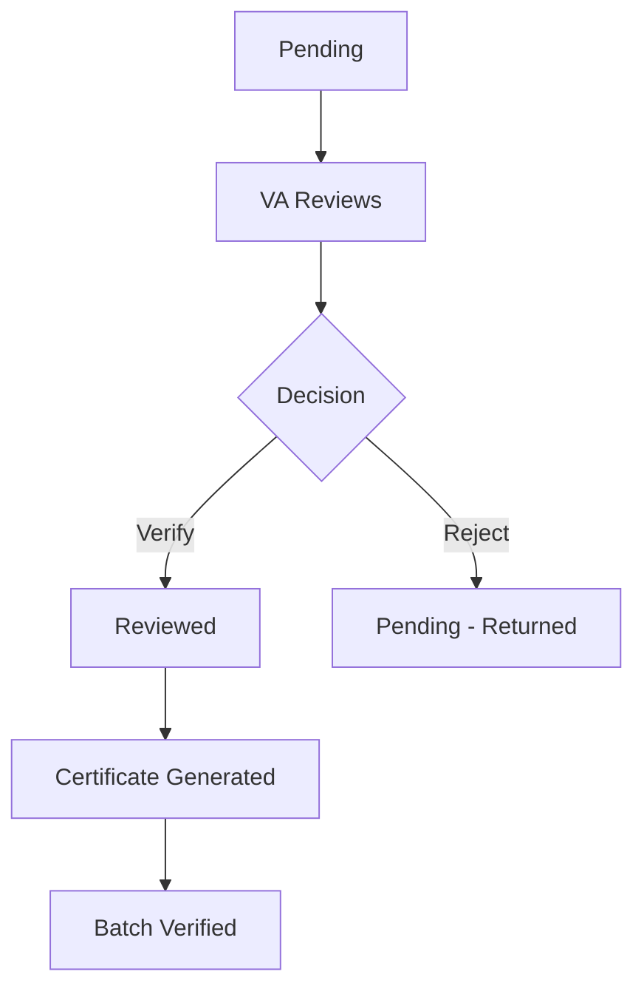
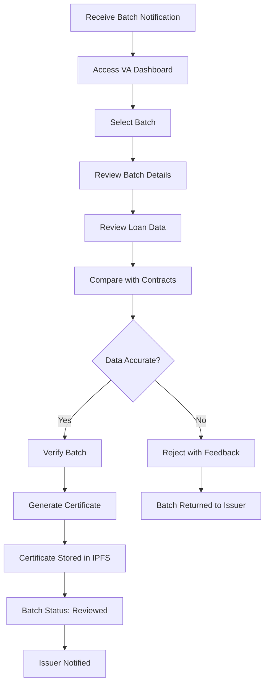

# Verification Agent Operations

This guide is for Verification Agents (VAs) who review and certify loan batches submitted by issuers. Learn how to access batches, review loan data, and complete verification.

## VA Dashboard Overview

The VA dashboard provides access to all batches assigned to your organization for verification.

**Dashboard Features:**
- View all assigned batches
- Filter by status (Pending, Verified, Reviewed)
- Search by Batch ID
- Access batch details and loan data
- Generate verification certificates

## Accessing Assigned Batches

### Step 1: Login as Verification Agent

1. Login to Intain Markets platform
2. Ensure you have VA role permissions
3. Navigate to VA dashboard

### Step 2: View Batches

**Batch List View Shows:**
- Batch ID and name
- Issuer organization name
- Number of loans in batch
- Submission date
- Current status
- Actions available

**Filtering Options:**
- **Status**: Filter by Pending, Verified, Reviewed
- **Issuer**: Filter by issuer organization
- **Date Range**: Filter by submission date
- **Search**: Search by Batch ID

## Batch Review Process

### Step 1: Select Batch

Click on a batch with status "Pending" to view details.

**Batch Details Include:**
- Batch ID and creation date
- Issuer organization information
- Number of loans included
- Asset class and loan type
- Submission date

### Step 2: Review Loan Data

**Access Loan List:**
- View all loans in the batch
- See individual loan details
- Review loan data fields
- Compare with source documents

**Loan Data Available:**
- Loan ID and identifiers
- Principal balances
- Interest rates and terms
- Borrower information
- Collateral details
- Payment history
- Status information

### Step 3: Compare with Source Documents

**Verification Checklist:**
- ✅ Loan ID matches source documents
- ✅ Principal balances are accurate
- ✅ Interest rates match contracts
- ✅ Borrower information is correct
- ✅ Collateral details are accurate
- ✅ Payment data is consistent
- ✅ All required fields are present

**Download Contracts:**
- Access loan contract files
- Download documents for review
- Compare system data with contracts
- Verify data accuracy

### Step 4: Verify or Reject

**If Data is Accurate:**

<Steps>
  <Step title="Click Verify Batch">
    Click the **Verify Batch** or **Certify** button.
  </Step>
  
  <Step title="Confirm Verification">
    Review verification details and confirm.
  </Step>
  
  <Step title="Generate Certificate">
    System automatically generates VA certificate:
    - PDF document with batch details
    - VA organization information
    - Verification confirmation
    - Loan list included
  </Step>
  
  <Step title="Certificate Stored">
    Certificate is:
    - Stored in IPFS
    - Linked to batch record
    - Available for download
  </Step>
  
  <Step title="Status Updated">
    Batch status updates:
    - `batchverified: "Yes"`
    - `verificationSource: "Certified"`
    - `status: "Reviewed"`
    - `VACertificate: <certificate details>`
  </Step>
  
  <Step title="Loans Updated">
    All loans in batch:
    - `workflow_status: "VERIFIED"`
    - `verificationSource: "Certified"`
  </Step>
  
  <Step title="Issuer Notified">
    Issuer receives notification:
    - Batch verification complete
    - Certificate available
    - Ready for NFT minting
  </Step>
</Steps>

**If Data Has Issues:**

<Steps>
  <Step title="Reject Batch">
    Click **Reject** or **Return for Changes**.
  </Step>
  
  <Step title="Provide Feedback">
    Enter reason for rejection:
    - Data discrepancies found
    - Missing required information
    - Inconsistencies identified
  </Step>
  
  <Step title="Submit Rejection">
    Batch status remains "Pending"
    - Issuer notified of rejection
    - Can address issues and resubmit
  </Step>
</Steps>

## VA Certificate Generation

### Certificate Contents

**VA Certificate Includes:**
- Batch ID and details
- Verification date
- VA organization information
- Number of loans verified
- Loan list (optional)
- Verification confirmation statement
- Digital signature

### Certificate Storage

**IPFS Storage:**
- Certificate stored in IPFS
- Immutable and decentralized
- IPFS hash stored in batch record
- Accessible via IPFS gateway

**Access:**
- Issuer can download certificate
- VA can access certificate
- Certificate linked to batch
- Historical record maintained

## Batch Status Management

### Status Updates

**VA Can Update:**
- Batch verification status
- Certificate generation
- Rejection with feedback

**Status Flow:**

### Status Reference

| Status | Description | VA Action |
|--------|-------------|-----------|
| **Pending** | Batch submitted, awaiting review | Review and verify |
| **Reviewed** | Batch verified by VA | Certificate generated |
| **Pending** (after rejection) | Returned to issuer | Issuer addresses issues |

## VA Workflow Summary

## Best Practices for VAs

<CardGroup cols={2}>
  <Card title="Thorough Review" icon="magnifying-glass">
    - Review all loans in batch carefully
    - Compare with source documents
    - Check data consistency
    - Verify completeness
  </Card>
  
  <Card title="Documentation" icon="file-alt">
    - Document any discrepancies found
    - Provide clear feedback on rejections
    - Maintain verification records
    - Keep audit trail
  </Card>
  
  <Card title="Timely Response" icon="clock">
    - Review batches promptly
    - Respond within agreed timeframe
    - Communicate delays if needed
    - Update status regularly
  </Card>
  
  <Card title="Quality Assurance" icon="shield-check">
    - Ensure verification standards met
    - Follow verification procedures
    - Maintain consistency
    - Uphold professional standards
  </Card>
</CardGroup>

## VA Permissions

### What VAs Can Do

| Action | Permission |
|--------|-----------|
| View Assigned Batches | ✅ Yes |
| Review Loan Data | ✅ Yes |
| Download Contracts | ✅ Yes |
| Verify Batches | ✅ Yes |
| Generate Certificates | ✅ Yes |
| Reject Batches | ✅ Yes |
| Update Batch Status | ✅ Yes |

### What VAs Cannot Do

| Action | Permission |
|--------|-----------|
| Modify Loan Data | ❌ No |
| Create Batches | ❌ No |
| Mint NFTs | ❌ No |
| Access Other Organizations' Batches | ❌ No |
| Modify Certificates After Generation | ❌ No |

## Troubleshooting

### Common Issues

<Tabs>
  <Tab title="Cannot See Batches">
    **Issue**: No batches appearing in dashboard
    
    **Solutions**:
    - Verify VA is assigned to issuer organization
    - Check batch was submitted to your VA
    - Confirm you have VA role permissions
    - Refresh dashboard
    - Contact support if issue persists
  </Tab>
  
  <Tab title="Cannot Verify Batch">
    **Issue**: Verify button disabled or not working
    
    **Solutions**:
    - Ensure batch status is "Pending"
    - Check you have verification permissions
    - Verify all required data is reviewed
    - Try refreshing the page
    - Contact support if issue persists
  </Tab>
  
  <Tab title="Certificate Not Generating">
    **Issue**: Certificate not created after verification
    
    **Solutions**:
    - Verify verification completed successfully
    - Check batch status updated correctly
    - Wait a few moments for processing
    - Refresh page to see certificate
    - Contact support if certificate missing
  </Tab>
</Tabs>

## VA Reporting

### Verification Metrics

VAs can track:
- Number of batches verified
- Verification completion rate
- Average review time
- Rejection rate and reasons

### Audit Trail

All VA actions are logged:
- Batch access records
- Verification timestamps
- Certificate generation dates
- Rejection reasons and feedback

---

<CardGroup cols={2}>
  <Card title="Previous: NFT Minting" icon="arrow-left" href="/user-guide/loan-onboarding/nft-minting">
    Go back to NFT minting
  </Card>
  
  <Card title="Back to Overview" icon="arrow-up" href="/user-guide/loan-onboarding/overview">
    Return to workflow overview
  </Card>
</CardGroup>

