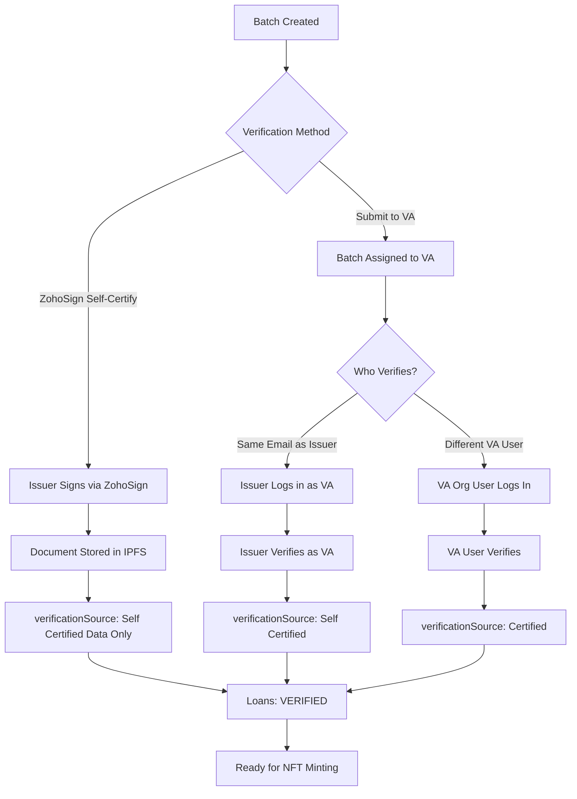
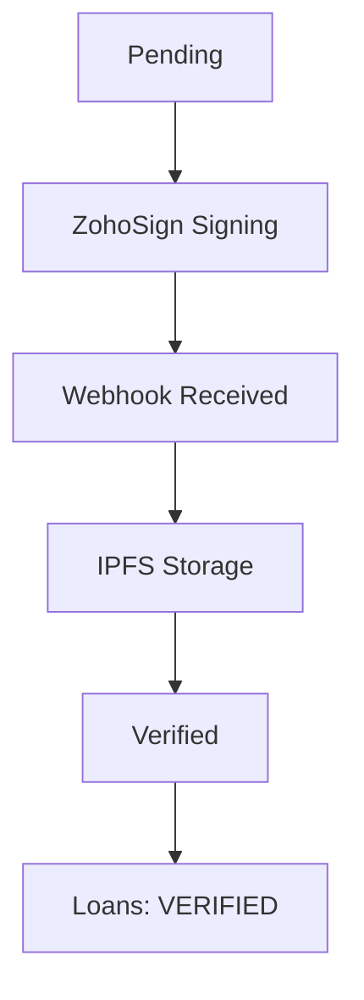

# Verification Flow

Verification is a critical step that confirms the accuracy of loan data before NFT minting. This guide covers both self-certification and third-party VA verification processes.

## What is Verification?

Verification is the process of confirming that loan data in the system matches the source documents and is accurate. The verification source depends on who performs the verification:

1. **Self-Certified (Data Only)**: Issuer self-certifies via ZohoSign electronic signature
2. **Self Certified**: Issuer submits to VA, but issuer logs in as VA (same email) and verifies themselves
3. **Certified**: Issuer submits to VA, and a different VA organization user logs in and certifies

All methods result in a verification certificate stored in IPFS and update loan statuses to "VERIFIED".

## Verification Decision Tree

## Self-Certification via ZohoSign

Self-certification allows issuers to certify their own loans using electronic signatures through ZohoSign integration.

### When to Use Self-Certification

- Issuer has confidence in data accuracy
- Quick verification process needed
- No regulatory requirement for third-party verification
- Internal compliance standards met

### Self-Certification Process

<Steps>
  <Step title="Select Batch">
    Navigate to **Batch Verification** tab and select a batch with status "Pending".
  </Step>
  
  <Step title="Initiate Self-Certification">
    Click **Self-Certify** or **ZohoSign Certify** button.
  </Step>
  
  <Step title="System Generates Document">
    The system automatically:
    - Retrieves all loans in the batch
    - Generates certification document (PDF)
    - Includes loan details and batch information
    - Prepares document for signing
  </Step>
  
  <Step title="ZohoSign Interface Opens">
    - Embedded ZohoSign signing interface opens
    - Document is displayed for review
    - Signing fields are highlighted
  </Step>
  
  <Step title="Review Document">
    Review the certification document:
    - Verify batch ID and loan count
    - Check loan details are accurate
    - Confirm all loans are included
  </Step>
  
  <Step title="Sign Document">
    - Click on signature field
    - Sign electronically (draw, type, or upload signature)
    - Confirm signature placement
  </Step>
  
  <Step title="Complete Signing">
    - Click **Complete** or **Finish Signing**
    - ZohoSign processes the signature
    - Signing completion page appears
  </Step>
</Steps>

<Frame caption="Batch Self-Certification">
  
</Frame>

### What Happens After Signing

**Automatic Processing:**
1. **Webhook Received**: ZohoSign sends webhook notification
2. **Document Downloaded**: Signed PDF downloaded from ZohoSign
3. **IPFS Storage**: Document uploaded to IPFS, hash stored
4. **Batch Updated**: 
   - `batchverified: "Yes"`
   - `verificationSource: "Self Certified (Data Only)"`
   - `status: "Verified"`
   - `VACertificate: <IPFS hash>`
5. **Loans Updated**:
   - `workflow_status: "VERIFIED"`
   - `verificationSource: "Self Certified (Data Only)"`
6. **Notification**: Issuer receives confirmation notification

**Status Flow:**

### ZohoSign Signing Interface

**Features:**
- **Embedded Signing**: Sign directly in platform (no external redirect)
- **Multiple Signature Methods**: Draw, type, or upload signature image
- **Document Review**: Full document preview before signing
- **Auto-Close**: Window closes automatically after signing
- **Status Tracking**: Real-time signing status updates

**Signing Complete Page:**
- Success confirmation message
- Instructions to return to platform
- Auto-refresh of parent page
- Manual close option if needed

## VA Verification

VA (Verification Agent) verification involves a third-party organization reviewing and certifying loan data accuracy.

### When to Use VA Verification

- Regulatory compliance requirements
- Investor due diligence needs
- Third-party validation required
- Complex loan structures needing expert review

### VA Verification Process

There are two scenarios for VA verification, which determine the `verificationSource` status:

**Scenario 1: Issuer Verifies as VA (Same Email)**
- Issuer submits batch to VA
- Issuer logs in using the same email address as the VA
- Issuer verifies the batch themselves
- Result: `verificationSource: "Self Certified"`

**Scenario 2: Different VA User Verifies**
- Issuer submits batch to VA
- A different user from the VA organization logs in
- That VA user verifies the batch
- Result: `verificationSource: "Certified"`

<Steps>
  <Step title="Select Batch">
    Navigate to **Batch Verification** tab and select a batch with status "Pending".
  </Step>
  
  <Step title="Submit to VA">
    Click **Submit to VA** button.
  </Step>
  
  <Step title="Select Verification Agent">
    Choose the Verification Agent organization from the list:
    - Only VAs assigned to your organization are shown
    - Select the appropriate VA for this batch
  </Step>
  
  <Step title="Confirm Submission">
    Review batch details and click **Submit**.
  </Step>
  
  <Step title="VA Receives Notification">
    - VA receives email/notification about new batch
    - Batch appears in VA dashboard
    - Batch status remains "Pending"
  </Step>
  
  <Step title="VA Reviews Batch">
    VA (or issuer logging in as VA) accesses batch through dashboard:
    - Views batch details and loan count
    - Reviews individual loan data
    - Compares with source documents/contracts
    - Validates data accuracy
  </Step>
  
  <Step title="VA Verifies">
    After review, VA:
    - Clicks **Verify Batch** button
    - Confirms data accuracy
    - Generates VA certificate
  </Step>
  
  <Step title="Certificate Generated">
    System generates VA certificate:
    - PDF document with batch details
    - VA organization information
    - Verification confirmation
    - Loan list included
  </Step>
  
  <Step title="Batch Updated">
    Batch status updates based on who verified:
    - `batchverified: "Yes"`
    - `status: "Reviewed"`
    - `VACertificate: <certificate details>`
    - **If same email as issuer**: `verificationSource: "Self Certified"`
    - **If different VA user**: `verificationSource: "Certified"`
  </Step>
  
  <Step title="Loans Updated">
    All loans in batch:
    - `workflow_status: "VERIFIED"`
    - `verificationSource`: Matches batch verification source
  </Step>
  
  <Step title="Issuer Notified">
    Issuer receives notification:
    - Batch verification complete
    - Certificate available for download
    - Ready for NFT minting
  </Step>
</Steps>

### VA Review Process

**What VA Reviews:**
- Loan data accuracy
- Field completeness
- Data consistency
- Source document comparison
- Compliance with standards

**VA Actions:**
- **Verify**: Confirm data is accurate
- **Reject**: Return batch if issues found
- **Request Changes**: Ask for corrections before verification

## Verification Status Reference

### Batch Status After Verification

| Verification Method | Who Verifies | Batch Status | batchverified | verificationSource |
|---------------------|-------------|--------------|---------------|-------------------|
| ZohoSign Self-Certify | Issuer (direct) | `Verified` | `Yes` | `Self Certified (Data Only)` |
| Submit to VA → Same Email | Issuer (as VA) | `Reviewed` | `Yes` | `Self Certified` |
| Submit to VA → Different User | VA Org User | `Reviewed` | `Yes` | `Certified` |

### Loan Status After Verification

| Field | Value After Verification |
|-------|--------------------------|
| `workflow_status` | `VERIFIED` |
| `verificationSource` | `Self Certified (Data Only)` or `Self Certified` or `Certified` |
| `batchid` | `<batchId>` (unchanged) |

**Verification Source Logic:**
- **`Self Certified (Data Only)`**: Issuer self-certified via ZohoSign without VA submission
- **`Self Certified`**: Issuer submitted to VA but verified themselves (same email as issuer)
- **`Certified`**: Different VA organization user verified the batch

## Verification Certificates

### Certificate Storage

**IPFS Storage:**
- All certificates stored in IPFS (InterPlanetary File System)
- Immutable and decentralized storage
- IPFS hash stored in batch record
- Accessible via IPFS gateway

**Certificate Contents:**
- Batch ID and details
- Loan count and list
- Verification date
- Verifier information (Issuer or VA)
- Digital signature confirmation

### Accessing Certificates

**From Batch Details:**
1. Navigate to batch details page
2. Click **View Certificate** or **Download Certificate**
3. Certificate opens/downloads from IPFS

**From Certificates Tab:**
1. Navigate to **Certificates** tab
2. View all certificates for verified batches
3. Download or view individual certificates

<Frame caption="Certificates Tab">
  
</Frame>

## Verification Best Practices

<CardGroup cols={2}>
  <Card title="Data Preparation" icon="clipboard-check">
    - Ensure loan data is accurate before batch creation
    - Review data quality before verification
    - Fix any errors before submitting
  </Card>
  
  <Card title="Batch Organization" icon="layer-group">
    - Group similar loans together
    - Keep batch sizes manageable
    - Use consistent verification method
  </Card>
  
  <Card title="Self-Certification" icon="signature">
    - Review document carefully before signing
    - Ensure all loans are included
    - Keep signed certificate for records
  </Card>
  
  <Card title="VA Verification" icon="user-shield">
    - Provide clear batch descriptions
    - Ensure source documents are available
    - Communicate with VA if questions arise
  </Card>
</CardGroup>

## Troubleshooting

### Self-Certification Issues

<Tabs>
  <Tab title="ZohoSign Not Opening">
    **Issue**: Signing interface doesn't open
    
    **Solutions**:
    - Check browser popup blocker settings
    - Ensure JavaScript is enabled
    - Try different browser
    - Clear browser cache
  </Tab>
  
  <Tab title="Signing Not Completing">
    **Issue**: Signature doesn't process
    
    **Solutions**:
    - Ensure all required fields are filled
    - Check internet connection
    - Try refreshing the signing page
    - Contact support if issue persists
  </Tab>
  
  <Tab title="Status Not Updating">
    **Issue**: Batch status remains "Pending" after signing
    
    **Solutions**:
    - Wait a few minutes for webhook processing
    - Refresh the page
    - Check ZohoSign webhook configuration
    - Verify signing was completed successfully
  </Tab>
</Tabs>

### VA Verification Issues

<Tabs>
  <Tab title="VA Not Receiving Batch">
    **Issue**: VA doesn't see submitted batch
    
    **Solutions**:
    - Verify VA is assigned to your organization
    - Check batch was submitted successfully
    - Confirm VA has proper permissions
    - Contact support to verify assignment
  </Tab>
  
  <Tab title="VA Verification Delayed">
    **Issue**: VA taking long to verify
    
    **Solutions**:
    - Contact VA directly for status update
    - Check VA dashboard for any issues
    - Ensure all required documents provided
    - Follow up with VA organization
  </Tab>
</Tabs>

---

<CardGroup cols={2}>
  <Card title="Previous: Batch Management" icon="arrow-left" href="/user-guide/loan-onboarding/batch-management">
    Go back to batch management
  </Card>
  
  <Card title="Next: NFT Minting" icon="arrow-right" href="/user-guide/loan-onboarding/nft-minting">
    Learn about NFT minting process
  </Card>
</CardGroup>

