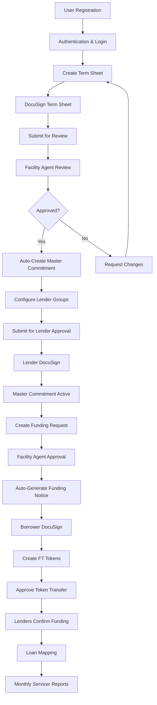

## What is the Credit Facility Platform?

The Intain Markets Credit Facility Platform is a comprehensive digital solution that streamlines the entire credit facility lifecycle, from initial term sheet creation to ongoing loan servicing and reporting. The platform integrates blockchain technology, electronic signatures, and automated workflows to provide a secure, transparent, and efficient credit facility management system.

## Key Components

### 1. **Term Sheet Management**
- Digital term sheet creation and negotiation
- DocuSign integration for electronic signatures
- Automated approval workflows
- Version control and revision tracking

### 2. **Master Commitment Configuration**
- Auto-creation from approved term sheets
- Lender group management
- Collateral eligibility rules setup
- Commitment amount allocation

### 3. **Funding Request Processing**
- Borrower funding requests against active commitments
- Facility agent review and approval
- Automated funding notice generation
- Real-time status tracking

### 4. **Funding Notice & Token Management**
- Automated FT token creation
- Token distribution to lenders
- Fund transfer confirmations
- Individual lender tracking

### 5. **Document Management**
- IPFS-based decentralized storage
- DocuSign electronic signatures
- Document versioning and audit trails
- Secure file uploads and downloads

### 6. **Loan Servicing**
- Monthly loan tape uploads
- Performance reporting
- Loan mapping to credit facilities
- Servicer operations management

## Complete Workflow Overview

## User Roles & Responsibilities

### **Issuer (Borrower)**
- Create and manage term sheets
- Submit funding requests
- Approve token transfers
- Manage loan collateral

### **Facility Agent (Underwriter)**
- Review and approve term sheets
- Configure master commitments
- Approve funding requests
- Manage facility operations

### **Lender (Investor)**
- Review master commitments
- Approve funding requests
- Confirm fund transfers
- Monitor investment performance

### **Servicer**
- Upload monthly loan tapes
- Generate performance reports
- Manage loan servicing
- Track loan performance

## Key Features

### **Automation & Integration**
- **Auto-Creation**: Master commitments automatically created from approved term sheets
- **Auto-Generation**: Funding notices automatically generated from approved funding requests
- **DocuSign Integration**: Seamless electronic signature workflows
- **IPFS Storage**: Decentralized document storage and retrieval

### **Security & Compliance**
- **Blockchain Integration**: Immutable record keeping
- **Role-Based Access**: Granular permission system
- **Audit Trails**: Complete transaction history
- **Data Encryption**: Secure data transmission and storage

### **User Experience**
- **Real-Time Updates**: Live status tracking
- **Auto-Save**: Prevent data loss during form completion
- **Mobile Responsive**: Access from any device
- **Intuitive Interface**: User-friendly design

## Status Management

The platform uses a comprehensive status management system to track the progress of each component:

### **Term Sheet Statuses**
- `Draft` → `BorrowerSigned` → `FAReview` → `Accepted`/`Rejected`/`CHANGES_REQUESTED`

### **Master Commitment Statuses**
- `Draft` → `PendingLenderApproval` → `ACTIVE`

### **Funding Request Statuses**
- `DRAFT` → `FAReview` → `APPROVED`/`REJECTED`/`CHANGES_REQUESTED`

### **Funding Notice Statuses**
- `PENDING_ESIGN` → `ESIGN_COMPLETED` → `ISSUED`

## Getting Started

1. **Register Your Account**: Complete user registration with appropriate role
2. **Verify Your Identity**: Complete KYC/AML verification process
3. **Access the Platform**: Login and navigate to your dashboard
4. **Start Your First Credit Facility**: Create a term sheet or review existing opportunities

## Next Steps

<Card title="User Registration Guide" icon="user-plus" href="/user-guide/registration">
  Learn how to register and set up your account
</Card>

<Card title="Credit Facility Flow" icon="diagram-project" href="/user-guide/credit-facility/overview">
  Understand the complete credit facility workflow
</Card>

<Card title="Role-Based Access" icon="users" href="/user-guide/roles/issuer">
  Learn about different user roles and permissions
</Card>
