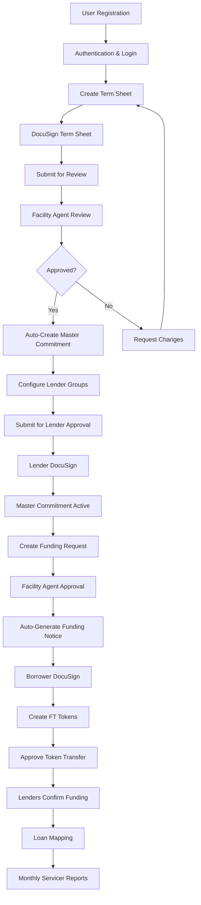

## What is Intain Markets?

Intain Markets is a comprehensive blockchain-based digital platform that transforms asset-backed finance through secure, transparent, and efficient workflows. The platform supports multiple financial market segments including credit facilities, whole loan investments, securitization, and preview/verification processes.

## Platform Architecture

<CardGroup cols={3}>
  <Card title="Blockchain Foundation" icon="link">
    All critical data stored on blockchain for immutability and transparency
  </Card>
  <Card title="IPFS Storage" icon="cloud">
    Decentralized document storage with version control
  </Card>
  <Card title="Smart Contracts" icon="code">
    Automated workflow execution and status management
  </Card>
  <Card title="DocuSign Integration" icon="signature">
    Electronic signature workflows for all documents
  </Card>
  <Card title="Role-Based Access" icon="shield-alt">
    Granular permissions for different user roles
  </Card>
  <Card title="Real-Time Updates" icon="sync">
    Live status tracking and notifications
  </Card>
</CardGroup>

## Platform Workflows

The Intain Markets platform supports four major workflows:

### 1. **Credit Facility Flow**
Complete end-to-end credit facility management:
- Term sheet creation and approval
- Master commitment configuration
- Funding requests and notices
- FT token management
- Loan mapping to facilities

<Card title="Credit Facility Overview" icon="briefcase" href="/user-guide/credit-facility/overview">
  Learn about the credit facility workflow
</Card>

### 2. **Whole Loan Flow**
Complete loan lifecycle management:
- Loan origination and application
- Active loan servicing
- Payment processing
- Investment opportunities
- Performance reporting

<Card title="Whole Loan Overview" icon="file-invoice-dollar" href="/user-guide/whole-loan/overview">
  Understand whole loan operations
</Card>

### 3. **Securitization Flow**
Asset-backed securities creation:
- Pool creation and management
- Deal onboarding and structuring
- Tranche creation and management
- Investor participation and tracking

<Card title="Securitization Overview" icon="coins" href="/user-guide/securitization/overview">
  Explore securitization workflows
</Card>

### 4. **Preview & Verification Flow**
Market evaluation and verification:
- Preview pool creation
- Loan tape uploads
- Verification agent review
- NFT minting for verified loans

<Card title="Preview & Verification Overview" icon="check-circle" href="/user-guide/preview/overview">
  Learn about preview and verification
</Card>

## Complete Workflow Overview

## Deal Setup Process

The credit facility process begins with deal setup, where you configure the initial parameters and create your term sheet.

## User Roles & Responsibilities

### **Issuer (Borrower)**
- Create and manage term sheets
- Submit funding requests
- Approve token transfers
- Manage loan collateral

### **Facility Agent (Underwriter)**
- Review and approve term sheets
- Configure master commitments
- Approve funding requests
- Manage facility operations

### **Lender (Investor)**
- Review master commitments
- Approve funding requests
- Confirm fund transfers
- Monitor investment performance

### **Servicer**
- Upload monthly loan tapes
- Generate performance reports
- Manage loan servicing
- Track loan performance

## Key Features

### **Automation & Integration**
- **Auto-Creation**: Master commitments automatically created from approved term sheets
- **Auto-Generation**: Funding notices automatically generated from approved funding requests
- **DocuSign Integration**: Seamless electronic signature workflows
- **IPFS Storage**: Decentralized document storage and retrieval

### **Security & Compliance**
- **Blockchain Integration**: Immutable record keeping
- **Role-Based Access**: Granular permission system
- **Audit Trails**: Complete transaction history
- **Data Encryption**: Secure data transmission and storage

### **User Experience**
- **Real-Time Updates**: Live status tracking
- **Auto-Save**: Prevent data loss during form completion
- **Mobile Responsive**: Access from any device
- **Intuitive Interface**: User-friendly design

## Status Management

The platform uses a comprehensive status management system to track the progress of each component:

### **Term Sheet Statuses**
- `Draft` → `BorrowerSigned` → `FAReview` → `Accepted`/`Rejected`/`CHANGES_REQUESTED`

### **Master Commitment Statuses**
- `Draft` → `PendingLenderApproval` → `ACTIVE`

### **Funding Request Statuses**
- `DRAFT` → `FAReview` → `APPROVED`/`REJECTED`/`CHANGES_REQUESTED`

### **Funding Notice Statuses**
- `PENDING_ESIGN` → `ESIGN_COMPLETED` → `ISSUED`

## Getting Started

1. **Register Your Account**: Complete user registration with appropriate role
2. **Verify Your Identity**: Complete KYC/AML verification process
3. **Access the Platform**: Login and navigate to your dashboard
4. **Start Your First Credit Facility**: Create a term sheet or review existing opportunities

## Key Features

### Automation & Integration
- **Auto-Creation**: Components automatically created based on approvals
- **Auto-Generation**: Documents and tokens generated automatically
- **DocuSign Integration**: Seamless electronic signature workflows
- **IPFS Storage**: Decentralized document storage and retrieval

### Security & Compliance
- **Blockchain Integration**: Immutable record keeping
- **Role-Based Access**: Granular permission system
- **Audit Trails**: Complete transaction history
- **Data Encryption**: Secure data transmission and storage

### User Experience
- **Real-Time Updates**: Live status tracking
- **Auto-Save**: Prevent data loss during form completion
- **Mobile Responsive**: Access from any device
- **Intuitive Interface**: User-friendly design

## User Roles

The platform supports multiple user roles:

<CardGroup cols={3}>
  <Card title="Issuer" icon="building" href="/user-guide/roles/issuer">
    Creates and manages facilities, pools, and deals
  </Card>
  <Card title="Facility Agent" icon="user-tie" href="/user-guide/roles/facility-agent">
    Reviews and approves credit facilities
  </Card>
  <Card title="Lender" icon="money-bill-wave" href="/user-guide/roles/lender">
    Funds facilities and manages investments
  </Card>
  <Card title="Servicer" icon="cogs" href="/user-guide/roles/servicer">
    Manages loan servicing and reporting
  </Card>
  <Card title="Verification Agent" icon="check-circle" href="/user-guide/roles/verification-agent">
    Verifies loan data quality
  </Card>
  <Card title="Market Maker" icon="users" href="/user-guide/roles/market-maker">
    Facilitates deal creation
  </Card>
</CardGroup>

## Platform Capabilities

### Multi-Market Support
- Credit facilities and revolving credit
- Whole loan investments and servicing
- Securitization deals and tranches
- Preview pools and verification

### Common Features Across All Workflows
- Blockchain-based record keeping
- IPFS document storage
- DocuSign electronic signatures
- Automated workflow progression
- Real-time status updates
- Comprehensive audit trails

## Getting Started

<Steps>
  <Step title="Register Your Account">
    Complete user registration with your appropriate role
  </Step>
  <Step title="Complete Verification">
    Complete KYC/AML and blockchain registration
  </Step>
  <Step title="Choose Your Workflow">
    Select the workflow that matches your needs
  </Step>
  <Step title="Start Managing">
    Access your dashboard and begin operations
  </Step>
</Steps>

## Next Steps

<Card title="User Registration Guide" icon="user-plus" href="/user-guide/registration">
  Learn how to register and set up your account
</Card>

<Card title="Role Overview" icon="users" href="/user-guide/roles/overview">
  Learn about all user roles and permissions
</Card>

<Card title="Platform Introduction" icon="rocket" href="/">
  Return to platform introduction
</Card>
