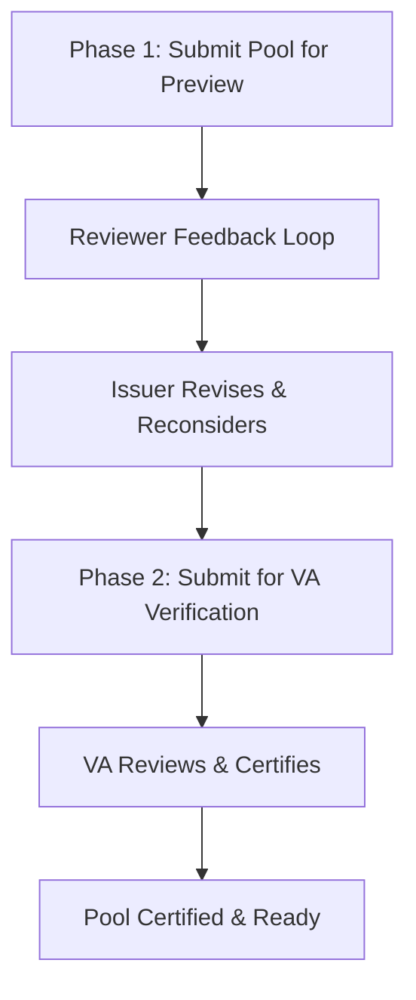

## Preview & Verification Flow Overview

The Preview & Verification workflow ensures that before any pool is accepted, priced, or published for investment, the underlying loan data is accurate, verified, and reviewed by all relevant stakeholders.

<Info>
**Purpose**: Preview & Verification provides a multi-phase collaborative process for reviewing, validating, and certifying loan pools before they enter securitization or sale workflows.
</Info>

## Workflow Overview

The Preview & Verification process encompasses two main phases:

## Key Phases

### Phase 1: Issuer Creates Pool and Submits for Preview
- Create pool with loan data
- Upload and map loan tapes
- Submit pool for preview with reviewers
- Collaborative feedback and reconsideration loop
- Finalize pool based on feedback

### Phase 2: Formal Verification and Certification
- Submit finalized pool to Verification Agent
- VA reviews loans and documents
- Issuer revises and resubmits if needed
- VA certifies pool and issues certificate
- Pool now investor-ready

## Key Components

### Preview Phase
**Purpose**: Allow early review and feedback before formal verification

**Features**:
- Collaborative review by multiple parties
- Loan-level feedback and comments
- Reconsideration workflow
- Version tracking and revision history

### Verification Phase
**Purpose**: Formal validation and certification by Verification Agent

**Features**:
- Field-level data validation
- Document consistency checks
- Asset eligibility verification
- Official VA certificate issuance

## User Roles

### **Issuer**
- Creates pool and uploads loan data
- Submits pool for preview and verification
- Addresses reviewer feedback
- Revises and resubmits based on feedback

### **Underwriter**
- Reviews pool in preview mode
- Provides feedback and comments
- Rejects loans with reasons
- Approves or requests changes

### **Rating Agency** (Optional)
- Reviews pool quality
- Provides rating perspective
- Offers quality feedback

### **Verification Agent (VA)**
- Performs formal data verification
- Validates field-level accuracy
- Certifies pool quality
- Issues verification certificate

## Status Model

<Table>

| Status | Description |
|--------|-------------|
| **Created** | Pool created, awaiting loan data |
| **Under Preview** | Pool submitted for reviewer feedback |
| **Submitted for Verification** | Pool submitted to VA for formal verification |
| **Certified / Verified** | Pool verified and certified by VA |
| **Rejected** | Pool failed verification (with reasons) |

</Table>

## Benefits

### Data Quality
- Multiple review layers
- Early error detection
- Formal validation
- VA certification

### Transparency
- Complete audit trail
- Documented feedback cycles
- Clear certification process
- Version history maintained

### Collaboration
- Multiple stakeholders involved
- Open feedback mechanism
- Responsive revision process
- Continuous improvement

### Risk Reduction
- Early review reduces VA rejections
- Issues addressed upfront
- Cleaner data before certification
- Higher certification success rate

## Use Cases

<CardGroup cols={2}>
  <Card title="Securitization Prep" icon="layer-group">
    Verify and clean pool before securitization structuring
  </Card>
  <Card title="Whole Loan Sale" icon="hand-holding-usd">
    Verify and certify pool before investor bidding
  </Card>
  <Card title="Data Quality" icon="check-circle">
    Ensure loan data accuracy and completeness
  </Card>
  <Card title="Regulatory Compliance" icon="shield-alt">
    Meet regulatory verification requirements
  </Card>
</CardGroup>

## Next Steps

<Card title="Complete Workflow Guide" icon="route" href="/user-guide/preview/workflow-overview">
  View the complete phase-by-phase Preview & Verification workflow
</Card>

<Card title="Securitization Flow" icon="layer-group" href="/user-guide/securitization/workflow-overview">
  Continue from verified pool to securitization
</Card>

<Card title="Whole Loan Flow" icon="hand-holding-usd" href="/user-guide/whole-loan/workflow-overview">
  Continue from verified pool to whole loan sale
</Card>
