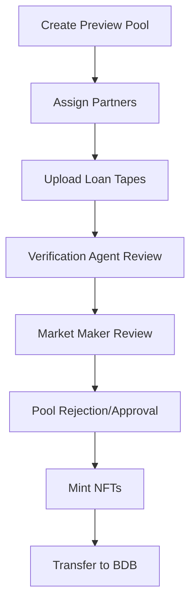

## Preview & Verification Overview

The Preview & Verification workflow enables issuers to create preview pools for market evaluation, upload loan tapes for verification agent review, and mint NFTs for verified loans.

## Workflow Overview

## Key Components

### 1. Preview Pool Creation

**Purpose**: Create a pool for market preview and evaluation

**Key Features**:
- Pool configuration
- Partner assignment
- Loan tape upload
- Status tracking

### 2. Loan Tape Management

**Purpose**: Upload and manage loan data files

**Key Features**:
- Excel file upload
- Data validation
- Mapping configuration
- Standard field mapping

### 3. Verification Process

**Purpose**: Ensure loan data quality and compliance

**Key Features**:
- Verification agent review
- Data quality checks
- Compliance verification
- Approval/rejection workflow

### 4. NFT Minting

**Purpose**: Create blockchain NFTs for verified loans

**Key Features**:
- Automatic NFT minting
- Blockchain recording
- Secure tokenization
- Transfer to BDB platform

## User Roles

<CardGroup cols={3}>
  <Card title="Issuer" icon="building">
    Creates preview pools and submits for review
  </Card>
  <Card title="Verification Agent" icon="check-circle">
    Reviews and verifies loan data quality
  </Card>
  <Card title="Market Maker" icon="users">
    Reviews pools and approves for market
  </Card>
</CardGroup>

## Status Flow

### Pool Statuses
- **Created**: Pool created, configuration in progress
- **Submitted**: Submitted for review
- **Under Review**: Being reviewed
- **Approved**: Approved for market
- **Rejected**: Rejected by reviewer

### Verification Statuses
- **Pending**: Awaiting verification
- **Verified**: Verified by agent
- **Rejected**: Failed verification

## Key Features

### Data Quality
- Automatic validation
- Standard field mapping
- Error detection
- Compliance checking

### Transparency
- Blockchain record keeping
- IPFS document storage
- Complete audit trail
- Version control

## Use Cases

<CardGroup cols={2}>
  <Card title="Market Evaluation" icon="search">
    Preview loans before full securitization
  </Card>
  <Card title="Data Verification" icon="check-circle">
    Ensure loan data quality and compliance
  </Card>
  <Card title="NFT Creation" icon="link">
    Mint blockchain NFTs for verified loans
  </Card>
  <Card title="Platform Transfer" icon="exchange-alt">
    Transfer verified loans to other platforms
  </Card>
</CardGroup>

## Next Steps

<Card title="Pool Creation" icon="layer-group" href="/user-guide/preview/pool-creation">
  Learn how to create preview pools
</Card>

<Card title="Loan Tape Upload" icon="upload" href="/user-guide/preview/loan-tape-upload">
  Understand loan tape upload process
</Card>

<Card title="Verification Process" icon="check-circle" href="/user-guide/preview/verification-process">
  Learn about verification workflow
</Card>

<Card title="NFT Minting" icon="link" href="/user-guide/preview/nft-minting">
  Understand NFT minting process
</Card>
