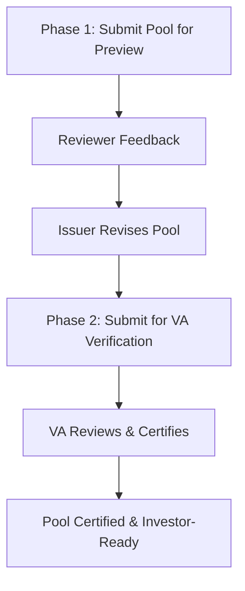

## Preview & Verification Flow — Complete Workflow

This guide explains how the Preview and Verification Flow ensures accurate, verified loan data through collaborative review before investment opportunities are published.

<Info>
**Preview & Verification ensures data quality** before pools are accepted, priced, or published for investment through collaborative feedback and formal verification by Verification Agents.
</Info>

## Overview

The Preview and Verification Flow ensures that before any pool is accepted, priced, or published for investment, the underlying loan data is:
- Accurate and verified
- Reviewed by stakeholders (Underwriters, Investors, Rating Agencies)
- Certified by Verification Agents
- Feedback collected, reconciled, and approved

**This process maintains** the integrity, quality, and credibility of the asset data within the platform.

## Key Phases



## Participants & Responsibilities

<Table>

| Role | Responsibility |
|------|---------------|
| **Issuer** | Creates pool, uploads loan tape, submits for preview and verification |
| **Underwriter** | Reviews pool, provides feedback, rejects loans with comments |
| **Rating Agency** | Optional reviewer providing quality feedback |
| **Investor** | Optional reviewer providing market perspective |
| **Verification Agent (VA)** | Performs formal verification and certification |

</Table>

## Phase 1 — Issuer Creates Pool and Submits for Preview

**Create Pool → Upload Loan Tape → Submit for Preview → Collaborative Feedback Loop**

🎯 **Objective**

Allow the Issuer to prepare a draft loan pool and share it in Preview mode with relevant parties (Underwriter, Rating Agency, Investors) before formal submission for verification.

**This is an optional but recommended review step to reduce rejections during VA certification.**

### 🧭 Actors Involved

<Table>

| Role | Responsibility |
|------|---------------|
| **Issuer** | Creates and submits pool for preview |
| **Underwriter (UW)** | Reviews loans, provides comments, and flags rejections |
| **Investor / Rating Agency** (optional) | Reviews summary and provides feedback |
| **Platform** | Records all comments and feedback cycles |

</Table>

### ⚙️ 1. Create Pool

**Navigation Path**: Issuer → **Pools** → Set Up Pool

**Steps**:

1. Navigate to **Pools** section
2. Click **Set Up Pool**
3. Enter details:
   - **Pool Name** (unique identifier)
   - **Asset Class** (Mortgage, Auto, Consumer, etc.)
   - **Transaction Type** (Whole Loan or Securitization)
   - **Description** (pool characteristics)
4. Click **Save**

**System Behavior**:
- Pool created in **Draft** state
- Pool record created with tabs: LoanTape, Strat, Summary, Documents, Feedback
- Serves as container for loan data to be reviewed

### 📂 2. Upload Loan Tape

**Navigation Path**: **Loans** → Add Loans → Upload Excel → Map Fields

**Steps**:

1. **Navigate to Loans** section
2. Click **Add Loans**
3. **Upload Excel loan file**:
   - Select Excel file (.xlsx)
   - System reads and parses data
   - Shows file preview

4. **Map Fields to Intain Standard**:
   - System displays uploaded columns
   - Map each column to Intain standard field:
     
     <Table>
     
     | Uploaded Column | Map To Intain Field |
     |----------------|---------------------|
     | Loan ID | Loan_Number |
     | Borrower | Obligor_Name |
     | Principal | Principal_Balance |
     | Interest Rate | Interest_Rate |
     | Term | Loan_Term |
     | Origination Date | Origination_Date |
     
     </Table>

5. **Validate mapping**:
   - Review mapped fields
   - Check data types
   - Verify required fields mapped

6. **Assign mapped loans to the newly created pool**:
   - Select target pool from dropdown
   - Click **Map to Pool**
   - Loans now linked to pool

**System Behavior**:
- **Auto-generates summary** and stratification charts
- Loan status: **Unmapped** → **Mapped** once assigned to pool
- Pool tabs (LoanTape, Strat, Summary) now display data

### 🔁 3. Submit Pool for Preview

**Navigation Path**: Pool Details → **Submit for Preview**

**Purpose**: To share the draft pool with Underwriter/Investors/Rating Agency for feedback prior to verification or underwriting.

**Steps**:

1. **From Pool Details page**, review pool contents:
   - Verify loan tape data
   - Check summary metrics
   - Review stratification
   - Ensure documents attached

2. **Click Submit for Preview**

3. **Choose participants**:
   - Select **Underwriter** (required)
   - Select **Investors** (optional)
   - Select **Rating Agency** (optional)

4. **Add message or notes** (optional):
   - Brief description
   - Special instructions
   - Key highlights

5. **Confirm submission**

**System Behavior**:
- **Pool status changes** to **Under Preview**
- **Participants notified** through dashboard and email
- **Feedback section opens** for reviewers to post comments
- Issuer retains edit capability (can revise and resubmit)

### 💬 4. Feedback and Reconsideration Loop

**Navigation Path**: Various — UW/RA/Investor → Review Pool → Provide Feedback; Issuer → Reconsider

**Purpose**: Allows reviewers to comment on or reject individual loans and provides Issuer an opportunity to address them.

**Workflow**:

**1. Underwriter / Reviewer Opens Pool**:
- Access pool from dashboard
- View loan tape data
- Review stratification and summary
- Examine loan-level details

**2. Reviewer Actions Available**:

<Table>

| Action | Role | Description |
|-------|------|-------------|
| **Approve** | UW / RA / Investor | Marks loan as approved |
| **Reject Loan** | UW / RA | Rejects specific loan(s) with comments and reason |
| **Comment** | All reviewers | Provides general or loan-specific feedback |
| **Request Information** | All reviewers | Asks for clarification or additional data |

</Table>

**3. Issuer Receives Feedback**:

**Feedback visible in**:
- **Feedback tab** in Pool Details
- Email notifications
- Dashboard alerts

**Issuer reviews rejections/comments** and can:

**Action 1: Accept (Remove/Modify Loan)**:
- Remove loan from pool
- Modify loan data
- Resubmit updated pool

**Action 2: Reject (Keep as-is)**:
- Keep loan despite reviewer concern
- Provide response/reason
- Continue with pool as-is

**Action 3: Exchange Feedback**:
- Clarify data or documentation
- Provide additional evidence
- Request reviewer reconsideration

**4. Feedback Cycle Continues** until all issues resolved

**Key Features**:

- **Timestamped entries**: Each feedback entry timestamped
- **Rejected loans automatically tagged**: For exclusion if Issuer accepts the rejection
- **Pool revision number increments**: With every resubmission
- **Complete audit trail**: All feedback preserved
- **Version history**: Track all pool versions

### 📊 Outputs of Phase 1

<Table>

| Output | Description |
|--------|-------------|
| Pool Status: Under Preview | Indicates pool shared for feedback |
| Reviewer Comments | Visible under Feedback tab with complete history |
| Reconsidered Loans | Tracked under Reconsider section for Issuer action |
| Updated Loan List | Post-feedback cleaned and revised pool |

</Table>

### 🧠 Why Phase 1 Is Critical

**Reduces Errors Before VA Certification**:
- Catch and fix issues early
- Avoid VA rejections
- Improve pool quality upfront

**Allows Early Validation**:
- By potential investors or UWs
- Market feedback collected
- Alignment with expectations

**Builds Trust and Collaboration**:
- Transparent review cycles
- Open communication
- Collaborative improvement

**Improves Data Integrity**:
- Pool quality enhanced
- Issues addressed before formal verification
- Higher success rate

### 🧩 Phase 1 Flow Summary

```
Issuer creates pool → Uploads loan tape
        ↓
Submit pool for Preview
        ↓
Underwriter / RA / Investor reviews → Provides feedback
        ↓
Issuer reviews feedback → Accepts/Reconsiders loans
        ↓
Revised pool finalized for Verification
```

✅ **End of Phase 1**

---

## Phase 2 — Formal Verification and Certification (VA Phase)

**Submit for VA → VA Reviews → Issuer Revises (if needed) → VA Certifies → Pool Certified**

🎯 **Objective**

To conduct formal data verification by the Verification Agent (VA) once the previewed and cleaned-up pool is finalized.

**This ensures every loan meets required standards and the verified pool can be used for securitization or sale.**

### 🧭 Actors Involved

<Table>

| Role | Responsibility |
|------|---------------|
| **Issuer** | Submits finalized pool to VA |
| **Verification Agent (VA)** | Performs formal verification and certification |
| **Underwriter / Investor** | Passive — may later rely on VA Certificate |
| **Platform (Intain)** | Enforces verification rules, status control, and document tracking |

</Table>

### ⚙️ 1. Submit for Verification

**Navigation Path**: Pool Details → **Submit for Verification**

**Steps**:

1. **Issuer reviews finalized pool post-feedback**:
   - All feedback addressed
   - Loan list cleaned and revised
   - Documentation complete

2. **Attach supporting documents**:
   - Loan contracts
   - Original tapes
   - Legal documentation
   - Other supporting files

3. **Click Submit for Verification**

**System Behavior**:
- **Pool status = Submitted for Verification**
- **VA receives notification** in dashboard
- **Loans locked** from further edits
- Ready for VA review

**Prerequisites**:
- [ ] Pool finalized post-preview feedback
- [ ] Loan data complete and accurate
- [ ] Supporting documents attached
- [ ] Ready for formal verification

### 🔍 2. VA Reviews Loans and Documents

**Navigation Path**: VA → **Batches** → View Loans

**Purpose**: To verify each loan's data accuracy and completeness.

**VA Accesses Pool**:

1. VA opens **Batches** tab
2. Locates pool (status = **Submitted for Verification**)
3. Clicks **View Loans**

**Checks Include**:

**Field-level Validation**:
- Principal, Interest Rate, Term, LTV, etc.
- Data completeness
- Data accuracy
- Format consistency

**Data/Document Consistency**:
- Compare against uploaded PDFs
- Verify origination documents
- Cross-reference with source data
- Check supporting documentation

**Asset Eligibility**:
- Meet eligibility criteria
- Data completeness
- Quality standards
- Regulatory compliance

**VA Actions**:

<Table>

| VA Action | Description |
|-----------|-------------|
| **Accept Loan** | All checks pass, loan approved |
| **Reject Loan** | Missing/inconsistent data; provide rejection reason |
| **Comment** | Feedback or clarification request to Issuer |

</Table>

**System Features**:
- **Inline document viewer** for quick reference
- **Filterable** by status (Accepted, Rejected, Pending)
- **Downloadable verification logs**
- **Batch-level review tools**

**Review Process**:
1. VA opens each loan record
2. Reviews all loan data
3. Compares against documents
4. Performs field-level validation
5. Checks data consistency
6. Marks as Accept/Reject/Comment
7. Records verification details

### 🔁 3. Issuer Revisions & Resubmissions (if needed)

**Navigation Path**: Issuer → **Pools** → View VA Feedback → Revise → Resubmit

**Steps** (if VA rejects or flags loans):

1. **Issuer reviews the VA feedback**:
   - Access Feedback tab in Pool Details
   - Review rejection reasons
   - Read VA comments
   - Understand required changes

2. **Correct the issues**:
   - **Data corrections**: Fix inaccuracies
   - **Document uploads**: Provide missing documents
   - **Loan modifications**: Update loan details
   - **Remove problematic loans**: If cannot be corrected

3. **Resubmit batch for re-verification**:
   - Make corrections in system
   - Click **Resubmit for Verification**
   - Include explanation of changes

**System Behavior**:
- **Versioning maintained** for each re-verification
- VA sees updated data in same batch thread
- History of revisions tracked
- All versions accessible for audit

**Feedback Loop Continues**:
- VA reviews revisions
- Accepts corrected loans
- Rejects still-problematic loans
- Process repeats until all loans approved

### 📜 4. Certification

**Navigation Path**: VA → **Batches** → Certify

**Purpose**: Once all loans pass, VA certifies the batch.

**Steps**:

1. **Select verified loans** (or entire pool):
   - All loans reviewed
   - All approved or rejected
   - No pending loans remaining

2. **Click Certify Batch**

3. **Upload or e-sign the Verification Certificate**:
   - Upload PDF certificate document
   - OR use e-signature functionality
   - Include VA signature and date

**System Behavior**:
- **Pool status = Certified / Verified**
- **Certificate attached** to the pool's Documents section
- **Verified flag set** for all accepted loans
- Official certification complete

**Certificate Details**:
- Batch ID and certification date
- Number of loans verified
- Number of loans rejected
- VA signature and certification details
- Issuer information
- Downloadable PDF format

### 📤 5. Issuer Notification

**System Behavior**:
- **Issuer receives confirmation**: "Pool Certified by Verification Agent"
- **Rejected loans** (if any) shown separately under "Unverified Loans"
- Pool status updated to **Certified/Verified**

**Certified loans are now eligible for**:
- **Securitization** (Pool → Deal Conversion)
- **Whole Loan Sale** (Investor Publishing)

**Issuer Actions After Certification**:
- View certified pool
- Download VA Certificate
- Review verified loan list
- Proceed with next workflow phase
- Handle rejected loans separately if needed

### 🔒 6. Verification Data Integrity Controls

<Table>

| Control | Description |
|--------|-------------|
| **Immutable Certificate Record** | Once uploaded, cannot be altered |
| **Batch ID & Audit Log** | Every VA action timestamped |
| **Role-Based Access** | Only VA can modify verification results |
| **Linkage** | Certificate linked directly to verified pool and loan IDs |

</Table>

**Additional Controls**:
- **Version Control**: All pool versions tracked
- **Audit Trail**: Complete history of reviews and revisions
- **Status Locking**: Loans locked after certification
- **Document Integrity**: Certificates stored immutably

### 📊 Outputs of Phase 2

<Table>

| Output | Description |
|--------|-------------|
| Verified Pool | Ready for investor publication or deal structuring |
| VA Certificate | Proof of data integrity and verification |
| Reverification Log | Full audit trail of checks and feedback |
| Unverified Loans Report | For Issuer's correction or exclusion |

</Table>

### 🧠 Why Phase 2 Is Critical

**Acts as Final Quality Checkpoint**:
- Before pool monetization
- Ensures data integrity
- Validates all loan information

**Enhances Trust**:
- Investor and regulator confidence
- Data validity confirmed
- Professional certification

**Creates Traceable Linkage**:
- Original data to certified record
- Complete audit trail
- Documentation linkage

**Prevents Non-Compliant Assets**:
- From entering financial structure
- Maintains quality standards
- Protects all stakeholders

### 🧩 Phase 2 Flow Summary

```
Issuer submits finalized pool for verification
        ↓
VA reviews each loan (approve/reject/comment)
        ↓
Issuer corrects any issues → resubmits
        ↓
VA certifies pool → issues Verification Certificate
        ↓
Pool status = Certified / Verified
        ↓
Ready for investor publication or deal structuring
```

✅ **End of Phase 2**

---

## Summary of Preview & Verification Flow

<Table>

| Phase | Title | Key Outcome |
|------|-------|-------------|
| **1** | Issuer Submits Pool for Preview | Collaborative review by UW/RA/Investor; feedback reconciled |
| **2** | Formal Verification by VA | Official validation and certification of data and documentation |

</Table>

**Result**: The pool is now fully verified, certified, and investor-ready, carrying an immutable VA Certificate that ensures data reliability throughout subsequent securitization or sale processes.

**Next Steps**:
- ✅ For **Securitization**: Pool can be submitted to Underwriter for deal structuring (Phase 2 of Securitization Flow)
- ✅ For **Whole Loan**: Pool can be published to Investors for bidding (Phase 3 of Whole Loan Flow)
- ✅ For **Verification**: Pool is now certified and ready for any further use

## Key Benefits

**Data Quality Assurance**:
- Multiple review layers ensure accuracy
- Early feedback reduces rejections
- Formal verification confirms integrity

**Transparency**:
- Complete audit trail
- Documented feedback cycles
- Clear certification process

**Collaboration**:
- Multiple stakeholders involved
- Open feedback mechanism
- Continuous improvement

**Investor Confidence**:
- VA certification ensures reliability
- Clear documentation trail
- Professional verification process

## Related Workflows

<Card title="Securitization Flow" icon="layer-group" href="/user-guide/securitization/workflow-overview">
  Continue from verified pool to securitization
</Card>

<Card title="Whole Loan Flow" icon="hand-holding-usd" href="/user-guide/whole-loan/workflow-overview">
  Continue from verified pool to whole loan sale
</Card>

<Card title="Return to Overview" icon="home" href="/user-guide/overview">
  View complete Intain Markets platform overview
</Card>

