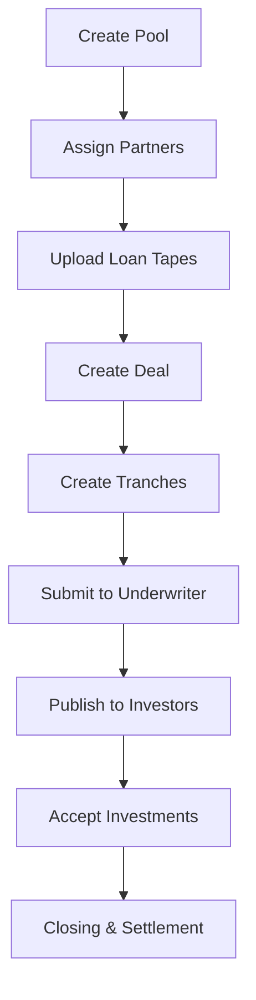

## Securitization Flow Overview

The Securitization workflow enables issuers to create asset-backed securities from loan pools. This comprehensive flow handles pool creation, deal structuring, tranche management, and investor participation.

## Workflow Overview

## Key Components

### 1. Pool Creation

**Purpose**: Create a pool of loans to be securitized

**Key Features**:
- Pool configuration and naming
- Partner assignment (servicers, underwriters, etc.)
- Loan tape upload and management
- Pool status tracking

### 2. Deal Onboarding

**Purpose**: Structure the securitization deal

**Key Features**:
- Deal terms and conditions
- Closing date setup
- Maturity dates
- Payment frequency
- Rating agency assignment

### 3. Tranche Management

**Purpose**: Create multiple tranches for investor investment

**Key Features**:
- Tranche creation and structuring
- Seniority levels
- Interest rates by tranche
- Payment waterfall design

### 4. Investment Management

**Purpose**: Enable investor participation

**Key Features**:
- Investor access to deals
- Investment tracking
- Payment distributions
- Performance reporting

## User Roles

<CardGroup cols={3}>
  <Card title="Issuer" icon="building">
    Creates pools and deals, manages securitization process
  </Card>
  <Card title="Underwriter" icon="user-tie">
    Reviews and approves deals for market
  </Card>
  <Card title="Investor" icon="hand-holding-usd">
    Invests in tranches and receives distributions
  </Card>
  <Card title="Servicer" icon="cogs">
    Manages loan servicing and monthly reporting
  </Card>
  <Card title="Rating Agency" icon="chart-bar">
    Provides credit ratings for deals
  </Card>
  <Card title="Paying Agent" icon="file-invoice">
    Processes payments and distributions
  </Card>
</CardGroup>

## Status Flow

### Pool Statuses
- **Created**: Pool created, awaiting configuration
- **Active**: Pool configured and ready for deals
- **Closed**: Pool closed, no longer accepting new deals

### Deal Statuses
- **Draft**: Deal being created
- **Submitted**: Submitted to underwriter for review
- **Approved**: Approved by underwriter
- **Published**: Published to investors
- **Funded**: Fully funded by investors
- **Closed**: Deal closed and settled

### Tranche Statuses
- **Created**: Tranche created
- **Offered**: Available for investment
- **Partially Funded**: Some investments received
- **Fully Funded**: Completely funded
- **Distributing**: Paying investors

## Key Features

### Automation
- Auto-create deals from pools
- Auto-generate tranches
- Auto-calculate distributions
- Auto-update investor balances

### Transparency
- Blockchain record keeping
- IPFS document storage
- Real-time status updates
- Complete audit trail

### Flexibility
- Custom tranche structures
- Multiple investor types
- Various deal types
- Configurable payment terms

## Use Cases

<CardGroup cols={2}>
  <Card title="Residential MBS" icon="home">
    Create residential mortgage-backed securities from loan pools
  </Card>
  <Card title="Auto Loans" icon="car">
    Securitize auto loan portfolios into tradable securities
  </Card>
  <Card title="Commercial Real Estate" icon="building">
    Structure CMBS deals from commercial mortgage pools
  </Card>
  <Card title="Consumer Loans" icon="credit-card">
    Package consumer loans into asset-backed securities
  </Card>
</CardGroup>

## Next Steps

<Card title="Pool Creation" icon="layer-group" href="/user-guide/securitization/pool-creation">
  Learn how to create and configure pools
</Card>

<Card title="Deal Onboarding" icon="file-contract" href="/user-guide/securitization/deal-onboarding">
  Understand deal creation and structuring
</Card>

<Card title="Tranche Management" icon="sitemap" href="/user-guide/securitization/tranche-management">
  Learn about tranche structures and management
</Card>

<Card title="Investment Management" icon="hand-holding-usd" href="/user-guide/securitization/investment-management">
  Explore investor participation and tracking
</Card>
