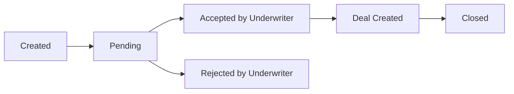
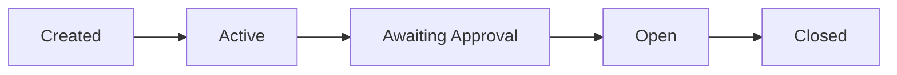
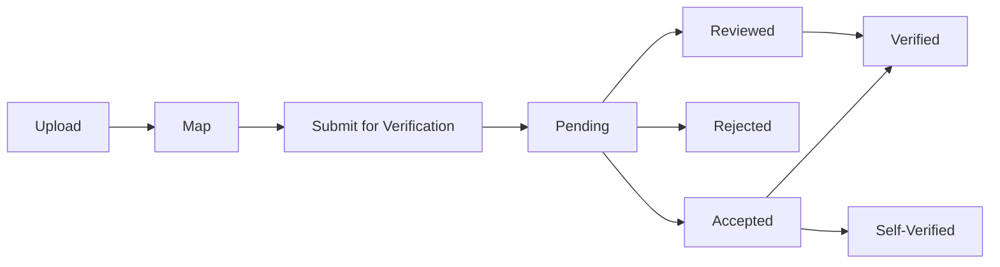

## State Transitions Reference

This guide documents all state transitions throughout the securitization process for Pools, Deals, and Loans.

## Pool State Transitions

### Complete Pool Status Flow

### Pool Status Definitions

**Created** (Pool Setup):
- Pool created with basic information
- Ready for loan onboarding
- Status after: "Set up Pool" → Save

**Pending** (Submitted to Underwriter):
- Issuer submitted pool to Underwriter
- Awaiting Underwriter review
- Status after: "Submit for Underwriter"

**Accepted by Underwriter** (Deal Created):
- Underwriter accepted pool
- System automatically creates Deal
- Deal status becomes "Created"
- Status after: Underwriter clicks "Accept Pool"

**Rejected by Underwriter**:
- Underwriter rejected pool
- Returned to Issuer for corrections
- Issuer receives notification with reason
- Status after: Underwriter clicks "Reject Pool"

**Closed** (Whole-Loan Transfer):
- Pool closed (rare in securitization)
- Used for whole-loan transfer cases
- Not typical for securitization workflow
- Status after: Final deal closure

<Note>
Pool status flow: Created → Pending → Accepted by Underwriter (deal created) OR Rejected by Underwriter → Closed (rare)
</Note>

## Deal State Transitions

### Complete Deal Status Flow

### Deal Status Definitions

**Created** (On Pool Acceptance):
- Deal created when Underwriter accepts pool
- Initial deal state
- Status after: Pool accepted by Underwriter

**Active** (Deal Creation Details Populated):
- Deal configuration in progress
- Deal details being populated
- Underwriter configuring deal structure
- Status after: Deal configuration begins

**Awaiting Approval** (UW Published to Issuer):
- Underwriter published deal to Issuer
- Awaiting Issuer FT approval
- Issuer must approve each tranche
- Status after: "Publish Deal to Issuer"

**Open** (Issuer Approved All Tranches):
- All tranches approved by Issuer
- Deal published to investors
- Available for investment
- Status after: Issuer approves all tranches and publishes

**Closed**:
- Deal fully funded and closed
- All distributions complete
- Final deal state
- Status after: Deal lifecycle complete

<Note>
Deal status flow: Created (on pool acceptance) → Active (deal creation details populated) → Awaiting Approval (UW published to Issuer) → Open (Issuer approved all tranches) → Closed
</Note>

## Loan/Batch State Transitions (VA)

### Complete Loan/Batch Status Flow

### Loan/Batch Status Definitions

**Upload**:
- Loan tape uploaded to system
- Initial state after upload
- Ready for field mapping

**Map**:
- Fields mapped to Intain standard
- Mapping complete, ready for verification
- Status after: Field mapping confirmed

**Submit for Verification** (Batch):
- Loans submitted to Verification Agent
- Batch created for VA review
- Status after: "Submit for Verification"

**Pending**:
- Awaiting Verification Agent review
- No action taken yet
- Status: Initial review state

**Accepted**:
- Verification Agent accepted batch
- Ready for certification
- Status after: VA accepts batch

**Rejected**:
- Verification Agent rejected batch
- Requires corrections
- Status after: VA rejects batch with reason

**Reviewed**:
- Verification Agent reviewed batch
- Comparison completed (LMS vs Contract)
- Ready for certification
- Status after: VA reviews and verifies data

**Verified** (Third-Party VA):
- Loans verified by external Verification Agent
- Enables NFT verification state
- Loans eligible for underwriting
- Status after: VA certifies with signature and verifies

**Self-Verified** (Issuer-as-VA):
- Issuer acting as own Verification Agent
- Self-certified loans
- Enables NFT verification state
- Status after: Issuer self-verifies

<Note>
Loan/Batch status flow: Upload → Map → Submit for Verification (batch) → Pending/Accepted/Rejected/Reviewed → Verified (Third-party VA) OR Self-Verified (Issuer-as-VA)
</Note>

## Preview Reconsider State Transitions

### Reconsider Workflow

**During Preview Stage**:

**Underwriter Actions**:
1. Reject Loan → Individual loan rejected with reason

**Issuer Response Options**:

**Accept the Rejection** (Remove):
- Issuer accepts UW rejection
- Loan removed from pool
- Not included in deal
- Action: "Accept Rejection"

**Reject the Rejection** (Keep):
- Issuer rejects UW rejection
- Loan remains in pool
- Provide feedback/justification
- Action: "Reject the Rejection"

**Feedback Loop**:
- Both parties exchange feedback
- Back-and-forth until resolution
- Use **Reconsider** feature to manage workflow
- Continues until either party prevails or compromise reached

### Reconsider Status States

**UW Rejected**:
- Underwriter rejected loan during preview
- Awaiting Issuer response
- Can be accepted or rejected by Issuer

**Issuer Accepted Rejection**:
- Loan removed from pool
- No longer in consideration
- Final state for rejected loan

**Issuer Rejected Rejection**:
- Loan kept in pool
- UW can respond with additional feedback
- Loop continues

<Note>
Preview Reconsider: During Preview, UW can Reject Loan → Issuer can Accept the Rejection (remove) OR Reject the Rejection (keep), with Feedback back-and-forth.
</Note>

## State Change Triggers

### Pool State Changes

| From | To | Trigger | Actor |
|------|-----|---------|-------|
| Created | Pending | Submit for Underwriter | Issuer |
| Pending | Accepted | Accept Pool | Underwriter |
| Pending | Rejected | Reject Pool | Underwriter |
| Accepted | Closed | Final closure | System |

### Deal State Changes

| From | To | Trigger | Actor |
|------|-----|---------|-------|
| Created | Active | Deal configuration begins | Underwriter |
| Active | Awaiting Approval | Publish Deal to Issuer | Underwriter |
| Awaiting Approval | Open | Approve all tranches & Publish | Issuer |
| Open | Closed | Deal lifecycle complete | System |

### Loan State Changes

| From | To | Trigger | Actor |
|------|-----|---------|-------|
| Upload | Map | Field mapping | Issuer |
| Map | Submit for Verification | Submit batch | Issuer |
| Submit | Pending | Batch created | System |
| Pending | Accepted/Rejected/Reviewed | VA review | VA |
| Accepted/Reviewed | Verified | Certify & Verify | VA |

## Best Practices

<Accordion>
<AccordionItem title="Monitor Status">
Regularly check current status before taking actions to ensure prerequisites are met.
</AccordionItem>

<AccordionItem title="Status Consistency">
Ensure status changes reflect actual state of the entity. Check before proceeding.
</AccordionItem>

<AccordionItem title="State History">
System maintains complete state history. Review history for audit purposes.
</AccordionItem>

<AccordionItem title="Reversal Limitations">
Some status transitions are irreversible. Verify before confirming status changes.
</AccordionItem>
</Accordion>

## Next Steps

<Card title="On-Chain & Off-Chain Actions" icon="link" href="/user-guide/securitization/blockchain-actions">
  Understand blockchain operations vs off-chain actions
</Card>

<Card title="UI Navigation" icon="map" href="/user-guide/securitization/ui-navigation">
  View role-based navigation guides
</Card>

<Card title="Workflow Overview" icon="diagram-project" href="/user-guide/securitization/workflow-overview">
  Return to complete workflow
</Card>
