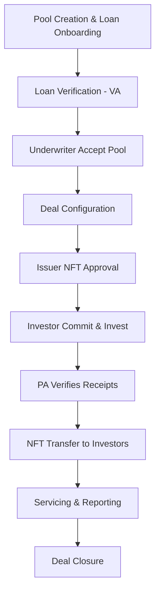

## Whole Loan Flow Overview

The Whole Loan workflow on Intain Markets enables comprehensive loan lifecycle management from initial pool creation through investor ownership and ongoing servicing. This workflow uses **NFTs** (Non-Fungible Tokens) to represent individual whole-loan ownership, distinguishing it from securitization flows that use Fungible Tokens (FTs) for tranche classes.

<Info>
**Key Difference**: Whole-Loan flows use **NFTs** (one per loan) versus Securitization flows which use **FTs** for tranche classes.
</Info>

## Workflow Overview

The whole loan process encompasses phases from pool creation to NFT transfer:

## Key Phases

### 1. Pool Creation & Loan Onboarding (Issuer)
- Set up pool with Transaction Type = Whole Loan
- Upload loan tape (Excel)
- Map fields to Intain standard
- Filter and map loans to pool

### 2. Loan Verification (VA)
- Submit loans for VA certification
- VA reviews and certifies loans
- Obtain VA certificate for underwriting eligibility

### 3. Underwriter Accept Pool & Create Deal
- Accept verified pool (converts to Deal)
- Configure deal (General, Files, Accounts)
- Publish to Issuer for NFT approval

### 4. Issuer NFT Approval
- Review deal configuration
- Approve NFT transfer authority (C-Chain)
- Publish to Investors

### 5. Investor Commit & Invest
- View whole-loan deal details
- Commit to purchase (usually full loan principal)
- Wire funds during Invest stage

### 6. PA Verifies & Transfers NFTs
- Verify investor off-chain receipts
- Transfer NFTs to investors (one NFT per loan)
- Complete settlement and ownership transfer

### 7. Servicing & Reporting
- Monthly loan tape processing
- Performance updates and reporting
- Investor dashboard updates

### 8. Deal Closure
- Status transitions to Closed
- All NFTs issued
- Complete ownership transfer

## Key Components

### Pool Creation
**Purpose**: Create pool containing whole loans to be marketed

**Key Features**:
- Set up pool with Whole Loan transaction type
- Upload and map loan tapes
- Filter loans for verification
- Preview pool analytics

### Loan Verification
**Purpose**: Obtain VA certification required for underwriting

**Key Features**:
- Submit loans to VA as batch
- VA reviews loan vs contract data
- VA certifies or rejects batch
- VA certificate issued upon certification

### Deal Configuration
**Purpose**: Prepare sale offering with deal metadata and accounts

**Key Features**:
- Configure deal general settings
- Upload deal files and documents
- Add off-chain accounts for investor wires
- No tranche structures (direct sale of loans)

### NFT Approval
**Purpose**: Authorize Intain to transfer NFTs on Issuer's behalf

**Key Features**:
- Issuer reviews deal
- Approve NFT transfer authority (C-Chain)
- High-security authorization step
- Same approval mechanism as securitization

### Investor Investment
**Purpose**: Enable investors to commit and purchase whole loans

**Key Features**:
- View comprehensive loan details
- Commit to specific loan(s) purchase
- Wire funds to designated accounts
- Mark payment as completed

### NFT Transfer
**Purpose**: Transfer NFT ownership to investors after fund verification

**Key Features**:
- PA verifies investor receipts
- Transfer NFTs on-chain (C-Chain)
- One NFT per whole loan
- Complete ownership transfer

### Ongoing Servicing
**Purpose**: Manage loan performance after ownership transfer

**Key Features**:
- Monthly loan tape processing
- Performance reporting
- Investor dashboard updates
- Deal recurring calculations

## Key Differences from Securitization

<Table>

| Aspect | Whole Loan | Securitization |
|--------|-----------|----------------|
| **Token Type** | NFTs (one per loan) | FTs (tranche classes) |
| **Commit Semantics** | Buy entire loan principal | Subscribe to tranche |
| **Settlement** | NFT transfer | FT mint/transfer |
| **Deal Structure** | Direct sale of whole loans | Tranche-based structure |

</Table>

## User Roles

### **Issuer**
- Create pool and upload loan tapes
- Map fields and submit for verification
- Approve NFT transfer authority
- Publish deal to investors

### **Underwriter**
- Accept pool and create deal
- Configure deal structure (no tranches)
- Add off-chain accounts
- Toggle Commit → Invest stages

### **Verification Agent (VA)**
- Review loan batches
- Check loan vs contract data
- Certify or reject loans
- Issue VA certificates

### **Investor**
- View whole-loan opportunities
- Commit to purchase specific loans
- Wire funds during Invest stage
- Receive NFTs and track ownership

### **Paying Agent**
- Verify investor off-chain receipts
- Transfer NFTs to investors
- Process monthly aggregations
- Generate investor reports

### **Servicer**
- Upload monthly loan tapes
- Map fields and summarize data
- Commit to Digital Ledger
- Support ongoing reporting

## Use Cases

<CardGroup cols={2}>
  <Card title="Whole Loan Sale" icon="hand-holding-usd">
    Enable issuers to sell individual whole loans to investors through NFT-based ownership transfer
  </Card>
  <Card title="Loan Ownership" icon="certificate">
    Use NFTs to represent and transfer ownership of individual loan assets on blockchain
  </Card>
  <Card title="Investor Opportunities" icon="search">
    Provide investors with comprehensive loan details for investment decisions
  </Card>
  <Card title="Lifecycle Management" icon="cogs">
    Support complete loan lifecycle from origination through servicing and reporting
  </Card>
</CardGroup>

## Status Model

<Table>

| Status Type | States | Description |
|------------|--------|-------------|
| **Pool** | Created → Submitted → Accepted/Rejected → Closed | Pool lifecycle from creation to deal conversion |
| **Deal** | Created → Awaiting Approval → Open → Closed | Deal lifecycle from creation to closure |
| **Loan/Batch (VA)** | Pending → Reviewed → Certified → Verified | Verification lifecycle for loan eligibility |
| **Investor Payment** | Pending → Marked Complete → Pending Verification → Verified → NFTs Issued | Payment and settlement process |

</Table>

## Getting Started

To get started with the Whole Loan flow:

1. **Configure Payment Settings** (Issuer/Investor/PA)
   - Set up off-chain bank details
   - Configure C-Chain address for NFT transfers

2. **Create Pool** (Issuer)
   - Set up pool with Transaction Type = Whole Loan
   - Upload and map loan tapes

3. **Submit for Verification** (Issuer)
   - Submit loans to VA for certification
   - Wait for VA review and certification

4. **Accept & Configure Deal** (Underwriter)
   - Accept pool (creates deal)
   - Configure deal settings and files
   - Publish to Issuer

5. **Approve NFTs** (Issuer)
   - Approve NFT transfer authority
   - Publish to Investors

6. **Commit & Invest** (Investor)
   - Commit to purchase loans
   - Wire funds when deal moves to Invest
   - Mark payment as completed

7. **Verify & Transfer** (Paying Agent)
   - Verify investor receipts
   - Transfer NFTs to investors

8. **Servicing** (Servicer & PA)
   - Process monthly loan tapes
   - Generate reports
   - Update investor dashboards

## Next Steps

<Card title="Complete Workflow Guide" icon="route" href="/user-guide/whole-loan/workflow-overview">
  View the complete phase-by-phase workflow documentation
</Card>

<Card title="Securitization Flow" icon="layer-group" href="/user-guide/securitization/workflow-overview">
  Compare with Securitization flow using FTs
</Card>

<Card title="UI Navigation" icon="map" href="/user-guide/roles">
  Learn role-based navigation for whole loan operations
</Card>

## Important Notes

<Warning>
**Payment Settings** must be configured before NFT approval. Issuer/Investor/PA should set up Payment Settings under User Profile before starting the flow.
</Warning>

<Info>
Whole-Loan uses **NFTs** (one per loan) to represent ownership, whereas Securitization uses **FTs** for tranche-based investments. This fundamental difference drives all workflow mechanics.
</Info>
