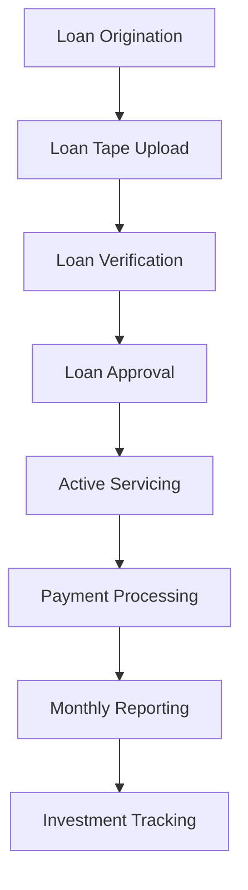

## Whole Loan Flow Overview

The Whole Loan workflow on Intain Markets enables comprehensive loan lifecycle management, from initial origination through active servicing, payment processing, and reporting. This workflow is designed for lenders, servicers, and investors managing individual loan assets.

## Workflow Overview

The whole loan process encompasses the complete loan lifecycle:

## Key Components

### 1. Loan Origination

**Purpose**: Create and onboard new loan applications

**Key Features**:
- Digital loan application creation
- Document upload and management
- Automated validation rules
- Status tracking through approval process

**Process Flow**:
- Create loan application with borrower details
- Upload supporting documents
- Submit for review
- Receive approval/rejection
- Activate loan upon approval

### 2. Loan Servicing

**Purpose**: Manage active loan portfolios throughout their lifecycle

**Key Features**:
- Monthly payment processing
- Escrow account management
- Delinquency tracking
- Modification processing
- Default management

**Key Operations**:
- Process borrower payments
- Update loan balances
- Manage loan status changes
- Generate payment statements
- Track payment history

### 3. Investment Management

**Purpose**: Enable investors to purchase whole loans

**Key Features**:
- Loan marketplace functionality
- Investment tracking
- Transfer processing
- Performance monitoring

**Investment Process**:
- Browse available loans
- Submit investment offers
- Complete due diligence
- Execute loan purchase
- Track investment performance

### 4. Reporting & Analytics

**Purpose**: Generate comprehensive loan performance reports

**Key Features**:
- Monthly servicer reports
- Delinquency reports
- Performance analytics
- Payment history reports
- Regulatory reporting

## Loan Statuses

The platform tracks loans through various statuses:

- **Origination**: New loan applications
- **Pending Review**: Under evaluation
- **Approved**: Ready for activation
- **Active**: Currently being serviced
- **Delinquent**: Past due payments
- **Default**: In default status
- **Paid Off**: Loan fully repaid
- **Closed**: Loan closed

## Key Features

### Automated Processing
- Auto-calculate payment amounts
- Auto-update balances
- Auto-generate payment statements
- Auto-track payment history

### Reporting
- Monthly servicer reports
- Delinquency tracking
- Performance analytics
- Payment history
- Investor reporting

### Integration
- IPFS document storage
- Blockchain record keeping
- DocuSign for documents
- Automated notifications

## User Roles in Whole Loan Flow

### **Lender (Loan Originator)**
- Create loan applications
- Upload loan tapes
- Approve loan funding
- Monitor loan performance

### **Servicer**
- Process loan payments
- Manage escrow accounts
- Update loan statuses
- Generate monthly reports

### **Investor**
- Browse available loans
- Submit investment offers
- Purchase whole loans
- Track investments

### **Paying Agent**
- Process fund distributions
- Manage payment schedules
- Handle account reconciliations

## Use Cases

<CardGroup cols={2}>
  <Card title="Portfolio Management" icon="layer-group">
    Manage large portfolios of whole loan assets with automated servicing and reporting
  </Card>
  <Card title="Loan Acquisition" icon="hand-holding-usd">
    Enable investors to purchase individual loans or loan portfolios
  </Card>
  <Card title="Servicer Operations" icon="cogs">
    Streamline loan servicing operations with automated payment processing
  </Card>
  <Card title="Performance Tracking" icon="chart-line">
    Track loan performance and generate comprehensive analytics reports
  </Card>
</CardGroup>

## Next Steps

<Card title="Loan Origination Guide" icon="file-alt" href="/user-guide/whole-loan/origination">
  Learn how to create and manage loan applications
</Card>

<Card title="Loan Servicing" icon="cogs" href="/user-guide/whole-loan/servicing">
  Understand loan servicing operations and payment processing
</Card>

<Card title="Investment Management" icon="hand-holding-usd" href="/user-guide/whole-loan/investment">
  Learn about whole loan investment opportunities
</Card>
